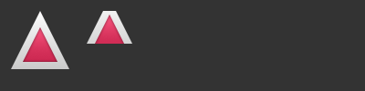

# Core Elements

Elements can be grouped into visual and non-visual elements. A visual element (like the `Rectangle`) has a geometry and normally presents an area on the screen. A non-visual element (like a `Timer`) provides general functionality, normally used to manipulate the visual elements.

Currently, we will focus on the fundamental visual elements, such as `Item`, `Rectangle`, `Text`, `Image` and `MouseArea`. However, by using the Qt Quick Controls 2 module, it is possible to create user interfaces built from standard platform components such as buttons, labels and sliders.

## Item Element

`Item` is the base element for all visual elements as such all other visual elements inherits from `Item`. It doesn’t paint anything by itself but defines all properties which are common across all visual elements:

* **Geometry** - `x` and `y` to define the top-left position, `width` and `height` for the expansion of the element, and `z` for the stacking order to lift elements up or down from their natural ordering.
* **Layout handling** - `anchors` (left, right, top, bottom, vertical and horizontal center) to position elements relative to other elements with optional `margins`.
* **Key handling** - attached `Key` and `KeyNavigation` properties to control key handling and the `focus` property to enable key handling in the first place.
* **Transformation** - `scale` and `rotate` transformation and the generic `transform` property list for *x,y,z* transformation, as well as a `transformOrigin` point.
* **Visual** - `opacity` to control transparency, `visible` to show/hide elements, `clip` to restrain paint operations to the element boundary, and `smooth` to enhance the rendering quality.
* **State definition** - `states` list property with the supported list of states, the current `state` property, and the `transitions` list property to animate state changes.

To better understand the different properties we will try to introduce them throughout this chapter in the context of the element presented. Please remember these fundamental properties are available on every visual element and work the same across these elements.

::: tip
The `Item` element is often used as a container for other elements, similar to the *div* element in HTML.
:::

## Rectangle Element

`Rectangle` extends `Item` and adds a fill color to it. Additionally it supports borders defined by `border.color` and `border.width`. To create rounded rectangles you can use the `radius` property.

```qml
Rectangle {
    id: rect1
    x: 12; y: 12
    width: 76; height: 96
    color: "lightsteelblue"
}
Rectangle {
    id: rect2
    x: 112; y: 12
    width: 76; height: 96
    border.color: "lightsteelblue"
    border.width: 4
    radius: 8
}
```


::: tip
Valid color values are colors from the SVG color names (see  [http://www.w3.org/TR/css3-color/#svg-color](http://www.w3.org/TR/css3-color/#svg-color)). You can provide colors in QML in different ways, but the most common way is an RGB string (‘#FF4444’) or as a color name (e.g. ‘white’).

A random color can be created using some JavaScript:

```qml
color: Qt.rgba( Math.random(), Math.random(), Math.random(), 1 )
```

:::

Besides a fill color and a border, the rectangle also supports custom gradients:

```qml
Rectangle {
    id: rect1
    x: 12; y: 12
    width: 176; height: 96
    gradient: Gradient {
        GradientStop { position: 0.0; color: "lightsteelblue" }
        GradientStop { position: 1.0; color: "slategray" }
    }
    border.color: "slategray"
}
```


A gradient is defined by a series of gradient stops. Each stop has a position and a color. The position marks the position on the y-axis (0 = top, 1 = bottom). The color of the `GradientStop` marks the color at that position.

::: tip
A rectangle with no *width/height* set will not be visible. This happens often when you have several rectangles width (height) depending on each other and something went wrong in your composition logic. So watch out!
:::

::: tip
It is not possible to create an angled gradient. For this, it’s better to use predefined images. One possibility would be to just rotate the rectangle with the gradient, but be aware the geometry of a rotated rectangle will not change and thus will lead to confusion as the geometry of the element is not the same as the visible area. From the author's perspective, it’s really better to use designed gradient images in that case.
:::

## Text Element

To display text, you can use the `Text` element. Its most notable property is the `text` property of type `string`. The element calculates its initial width and height based on the given text and the font used. The font can be influenced using the font property group (e.g. `font.family`, `font.pixelSize`, …). To change the color of the text just use the `color` property.

```qml
Text {
    text: "The quick brown fox"
    color: "#303030"
    font.family: "Ubuntu"
    font.pixelSize: 28
}
```


Text can be aligned to each side and the center using the `horizontalAlignment` and `verticalAlignment` properties. To further enhance the text rendering you can use the `style` and `styleColor` property, which allows you to render the text in outline, raised and sunken mode. 

For longer text, you often want to define a *break* position like *A very … long text*, this can be achieved using the `elide` property. The `elide` property allows you to set the elide position to the left, right or middle of your text. 

In case you don’t want the ‘…’ of the elide mode to appear but still want to see the full text you can also wrap the text using the `wrapMode` property (works only when the width is explicitly set):

```qml
Text {
    width: 40; height: 120
    text: 'A very long text'
    // '...' shall appear in the middle
    elide: Text.ElideMiddle
    // red sunken text styling
    style: Text.Sunken
    styleColor: '#FF4444'
    // align text to the top
    verticalAlignment: Text.AlignTop
    // only sensible when no elide mode
    // wrapMode: Text.WordWrap
}
```

A `Text` element only displays the given text, and the remaining space it occupies is transparent. This means it does not render any background decoration, and so it's up to you to provide a sensible background if desired.

::: tip
Be aware that the initial width of a `Text` item is dependant on the font and text string that were set. A `Text` element with no width set and no text will not be visible, as the initial width will be 0.
:::

::: tip
Often when you want to layout `Text` elements you need to differentiate between aligning the text inside the `Text` element boundary box and aligning the element boundary box itself. In the former, you want to use the `horizontalAlignment` and `verticalAlignment` properties, and in the latter case, you want to manipulate the element geometry or use anchors.
:::

## Image Element

An `Image` element is able to display images in various formats (e.g. `PNG`, `JPG`, `GIF`, `BMP`, `WEBP`). *For the full list of supported image formats, please consult the [Qt documentation](https://doc.qt.io/qt-6/qimagereader.html#supportedImageFormats)*. Besides the `source` property to provide the image URL, it contains a `fillMode` which controls the resizing behavior.

```qml
Image {
    x: 12; y: 12
    // width: 72
    // height: 72
    source: "assets/triangle_red.png"
}
Image {
    x: 12+64+12; y: 12
    // width: 72
    height: 72/2
    source: "assets/triangle_red.png"
    fillMode: Image.PreserveAspectCrop
    clip: true
}
```



::: tip
A URL can be a local path with forward slashes ( “./images/home.png” ) or a web-link (e.g. “[http://example.org/home.png](http://example.org/home.png)”).
:::

::: tip
`Image` elements using `PreserveAspectCrop` should also enable clipping to avoid image data being rendered outside the `Image` boundaries. By default clipping is disabled (`clip: false`). You need to enable clipping (`clip: true`) to constrain the painting to the elements bounding rectangle. This can be used on any visual element, but [should be used sparingly](https://doc.qt.io/qt-6/qtquick-performance.html#clipping).
:::

::: tip
Using C++ you are able to create your own image provider using `QQuickImageProvider`. This allows you to create images on the fly and make use of threaded image loading.
:::

## MouseArea Element

To interact with these elements you will often use a `MouseArea`. It’s a rectangular invisible item in which you can capture mouse events. The mouse area is often used together with a visible item to execute commands when the user interacts with the visual part.

```qml
Rectangle {
    id: rect1
    x: 12; y: 12
    width: 76; height: 96
    color: "lightsteelblue"
    MouseArea {
        id: area
        width: parent.width
        height: parent.height
        onClicked: rect2.visible = !rect2.visible
    }
}

Rectangle {
    id: rect2
    x: 112; y: 12
    width: 76; height: 96
    border.color: "lightsteelblue"
    border.width: 4
    radius: 8
}
```


::: tip
This is an important aspect of Qt Quick: the input handling is separated from the visual presentation. This allows you to show the user an interface element where the actual interaction area can be larger.
:::

::: tip
For more complex interaction, see [Qt Quick Input Handlers](https://doc.qt.io/qt-6/qtquickhandlers-index.html). They are intended to be used instead of elements such as `MouseArea` and `Flickable` and offer greater control and flexibility. The idea is to handle one interaction aspect in each handler instance instead of centralizing the handling of all events from a given source in a single element, which was the case before.
:::

