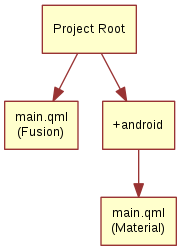

# An Image Viewer

Let’s look at a larger example of how Qt Quick Controls are used. For this, we will create a simple image viewer.

First, we create it for desktop using the Fusion style, then we will refactor it for a mobile experience before having a look at the final code base.

## The Desktop Version

The desktop version is based around a classic application window with a menu bar, a tool bar and a document area. The application can be seen in action below.


We use the Qt Creator project template for an empty Qt Quick application as a starting point. However, we replace the default `Window` element from the template with a `ApplicationWindow` from the `QtQuick.Controls` module. The code below shows `main.qml` where the window itself is created and setup with a default size and title.

```qml
import QtQuick
import QtQuick.Controls
import Qt.labs.platform as Platform

ApplicationWindow {
    visible: true
    width: 640
    height: 480

    // ...

}
```

The `ApplicationWindow` consists of four main areas as shown below. The menu bar, tool bar and status bar are usually populated by instances of `MenuBar`, `ToolBar` or `TabBar` controls, while the contents area is where the children of the window go. Notice that the image viewer application does not feature a status bar; that is why it is missing from the code show here, as well as from the figure above.


As we are targeting desktop, we enforce the use of the *Fusion* style. This can be done via a configuration file, environment variables, command line arguments, or programmatically in the C++ code. We do it the latter way by adding the following line to `main.cpp`:

```cpp
QQuickStyle::setStyle("Fusion");
```

We then start building the user interface in `main.qml` by adding an `Image` element as the contents. This element will hold the images when the user opens them, so for now it is just a placeholder. The `background` property is used to provide an element to the window to place behind the contents. This will be shown when there is no image loaded, and as borders around the image if the aspect ratio does not let it fill the contents area of the window.

```qml
ApplicationWindow {
    
    // ...
    
    background: Rectangle {
        color: "darkGray"
    }

    Image {
        id: image
        anchors.fill: parent
        fillMode: Image.PreserveAspectFit
        asynchronous: true
    }

    // ...

}
```

We then continue by adding the `ToolBar`. This is done using the `toolBar` property of the window. Inside the tool bar we add a `Flow` element which will let the contents fill the width of the control before overflowing to a new row. Inside the flow we place a `ToolButton`.

The `ToolButton` has a couple of interesting properties. The `text` is straight forward. However, the `icon.name` is taken from the [freedesktop.org Icon Naming Specification](https://specifications.freedesktop.org/icon-naming-spec/icon-naming-spec-latest.html). In that document, a list of standard icons are listed by name. By referring to such a name, Qt will pick out the correct icon from the current desktop theme.

In the `onClicked` signal handler of the `ToolButton` is the final piece of code. It calls the `open` method on the `fileOpenDialog` element.

```qml
ApplicationWindow {
    
    // ...
    
    header: ToolBar {
        Flow {
            anchors.fill: parent
            ToolButton {
                text: qsTr("Open")
                icon.name: "document-open"
                onClicked: fileOpenDialog.open()
            }
        }
    }

    // ...

}
```

The `fileOpenDialog` element is a `FileDialog` control from the `Qt.labs.platform` module. The file dialog can be used to open or save files. We import the `Qt.labs.platform` as `Platform`, to avoid a naming collision with the `QtQuick.Controls` import, hence we refer to it as `Platform.FileDialog`.

In the code we start by assigning a `title`. Then we set the starting folder using the `StandardsPaths` class. The `StandardsPaths` class holds links to common folders such as the user’s home, documents, and so on. After that we set a name filter that controls which files the user can see and pick using the dialog.

Finally, we reach the `onAccepted` signal handler where the `Image` element that holds the window contents is set to show the selected file. There is an `onRejected` signal as well, but we do not need to handle it in the image viewer application.

```qml
ApplicationWindow {
    
    // ...
    
    FileDialog {
        id: fileOpenDialog
        title: "Select an image file"
        folder: StandardPaths.writableLocation(StandardPaths.DocumentsLocation)
        nameFilters: [
            "Image files (*.png *.jpeg *.jpg)",
        ]
        onAccepted: {
            image.source = fileOpenDialog.fileUrl
        }
    }

    // ...

}
```

We then continue with the `MenuBar`. To create a menu, one puts `Menu` elements inside the menu bar, and then populates each `Menu` with `MenuItem` elements.

In the code below, we create two menus, *File* and *Help*. Under *File*, we place *Open* using the same icon and action as the tool button in the tool bar. Under *Help*, you find *About* which triggers a call to the `open` method of the `aboutDialog` element.

Notice that the ampersands (“&”) in the `title` property of the `Menu` and the `text` property of the `MenuItem` turn the following character into a keyboard shortcut; e.g. you reach the file menu by pressing *Alt+F*, followed by *Alt+O* to trigger the open item.

```qml
ApplicationWindow {
    
    // ...
    
    menuBar: MenuBar {
        Menu {
            title: qsTr("&File")
            MenuItem {
                text: qsTr("&Open...")
                icon.name: "document-open"
                onTriggered: fileOpenDialog.open()
            }
        }

        Menu {
            title: qsTr("&Help")
            MenuItem {
                text: qsTr("&About...")
                onTriggered: aboutDialog.open()
            }
        }
    }

    // ...

}
```

The `aboutDialog` element is based on the `Dialog` control from the `QtQuick.Controls` module, which is the base for custom dialogs. The dialog we are about to create is shown in the figure below.


The code for the `aboutDialog` can be split into three parts. First, we setup the dialog window with a title. Then, we provide some contents for the dialog – in this case, a `Label` control. Finally, we opt to use a standard *Ok* button to close the dialog.

```qml
ApplicationWindow {
    
    // ...
    
    Dialog {
        id: aboutDialog
        title: qsTr("About")
        Label {
            anchors.fill: parent
            text: qsTr("QML Image Viewer\nA part of the QmlBook\nhttp://qmlbook.org")
            horizontalAlignment: Text.AlignHCenter
        }

        standardButtons: StandardButton.Ok
    }

    // ...

}
```

The end result of all this is a functional, albeit simple, desktop application for viewing images.

## Moving to Mobile

There are a number of differences in how a user interface is expected to look and behave on a mobile device compared to a desktop application. The biggest difference for our application is how the actions are accessed. Instead of a menu bar and a tool bar, we will use a drawer from which the user can pick the actions. The drawer can be swiped in from the side, but we also offer a hamburger button in the header. The resulting application with the drawer open can be seen below.


First of all, we need to change the style that is set in `main.cpp` from *Fusion* to *Material*:

```cpp
QQuickStyle::setStyle("Material");
```

Then we start adapting the user interface. We start by replacing the menu with a drawer. In the code below, the `Drawer` component is added as a child to the `ApplicationWindow`. Inside the drawer, we put a `ListView` containing `ItemDelegate` instances. It also contains a `ScrollIndicator` used to show which part of a long list is being shown. As our list only consists of two items, the indicator is not visible in this example.

The drawer's `ListView` is populated from a `ListModel` where each `ListItem` corresponds to a menu item. Each time an item is clicked, in the `onClicked` method, the `triggered` method of the corresponding `ListItem` is called. This way, we can use a single delegate to trigger different actions.

```qml
ApplicationWindow {
    
    // ...
    
    id: window

    Drawer {
        id: drawer

        width: Math.min(window.width, window.height) / 3 * 2
        height: window.height

        ListView {
            focus: true
            currentIndex: -1
            anchors.fill: parent

            delegate: ItemDelegate {
                width: parent.width
                text: model.text
                highlighted: ListView.isCurrentItem
                onClicked: {
                    drawer.close()
                    model.triggered()
                }
            }

            model: ListModel {
                ListElement {
                    text: qsTr("Open...")
                    triggered: function() { fileOpenDialog.open(); }
                }
                ListElement {
                    text: qsTr("About...")
                    triggered: function() { aboutDialog.open(); }
                }
            }

            ScrollIndicator.vertical: ScrollIndicator { }
        }
    }

    // ...

}
```

The next change is in the `header` of the `ApplicationWindow`. Instead of a desktop style toolbar, we add a button to open the drawer and a label for the title of our application.


The `ToolBar` contains two child elements: a `ToolButton` and a `Label`.

The `ToolButton` control opens the drawer. The corresponding `close` call can be found in the `ListView` delegate. When an item has been selected, the drawer is closed. The icon used for the `ToolButton` comes from the [Material Design Icons page](https://material.io/tools/icons/?style=baseline).

```qml
ApplicationWindow {
    
    // ...
    
    header: ToolBar {
        ToolButton {
            id: menuButton
            anchors.left: parent.left
            anchors.verticalCenter: parent.verticalCenter
            icon.source: "images/baseline-menu-24px.svg"
            onClicked: drawer.open()
        }
        Label {
            anchors.centerIn: parent
            text: "Image Viewer"
            font.pixelSize: 20
            elide: Label.ElideRight
        }
    }

    // ...

}
```

Finally we make the background of the toolbar pretty — or at least orange. To do this, we alter the `Material.background` attached property. This comes from the `QtQuick.Controls.Material` module and only affects the Material style.

```qml
import QtQuick.Controls.Material

ApplicationWindow {
    
    // ...
    
    header: ToolBar {
        Material.background: Material.Orange

    // ...

}
```

With these few changes we have converted our desktop image viewer to a mobile-friendly version.

## A Shared Codebase

In the past two sections we have looked at an image viewer developed for desktop use and then adapted it to mobile.

Looking at the code base, much of the code is still shared. The parts that are shared are mostly associated with the document of the application, i.e. the image. The changes have accounted for the different interaction patterns of desktop and mobile, respectively. Naturally, we would want to unify these code bases. QML supports this through the use of *file selectors*.

A file selector lets us replace individual files based on which selectors are active. The Qt documentation maintains a list of selectors in the documentation for the `QFileSelector` class ([link](https://doc.qt.io/qt-5/qfileselector.html)). In our case, we will make the desktop version the default and replace selected files when the *android* selector is encountered. During development you can set the environment variable `QT_FILE_SELECTORS` to `android` to simulate this.

::: tip File Selector
File selectors work by replacing files with an alternative when a *selector* is present.

By creating a directory named `+selector` (where `selector` represents the name of a selector) in the same directory as the files that you want to replace, you can then place files with the same name as the file you want to replace inside the directory. When the selector is present, the file in the directory will be picked instead of the original file.

The selectors are based on the platform: e.g. android, ios, osx, linux, qnx, and so on. They can also include the name of the Linux distribution used (if identified), e.g. debian, ubuntu, fedora. Finally, they also include the locale, e.g. en_US, sv_SE, etc.

It is also possible to add your own custom selectors.
:::

The first step to do this change is to isolate the shared code. We do this by creating the `ImageViewerWindow` element which will be used instead of the `ApplicationWindow` for both of our variants. This will consist of the dialogs, the `Image` element and the background. In order to make the open methods of the dialogs available to the platform specific code, we need to expose them through the functions `openFileDialog` and `openAboutDialog`.

```qml
import QtQuick
import QtQuick.Controls
import Qt.labs.platform as Platform

ApplicationWindow {
    function openFileDialog() { fileOpenDialog.open(); }
    function openAboutDialog() { aboutDialog.open(); }

    visible: true
    title: qsTr("Image Viewer")

    background: Rectangle {
        color: "darkGray"
    }

    Image {
        id: image
        anchors.fill: parent
        fillMode: Image.PreserveAspectFit
        asynchronous: true
    }

    Platform.FileDialog {
        id: fileOpenDialog

        // ...

    }

    Dialog {
        id: aboutDialog

        // ...

    }
}
```

Next, we create a new `main.qml` for our default style *Fusion*, i.e. the desktop version of the user interface.

Here, we base the user interface around the `ImageViewerWindow` instead of the `ApplicationWindow`. Then we add the platform specific parts to it, e.g. the `MenuBar` and `ToolBar`. The only changes to these is that the calls to open the respective dialogs are made to the new functions instead of directly to the dialog controls.

```qml
import QtQuick
import QtQuick.Controls

ImageViewerWindow {
    id: window
    
    width: 640
    height: 480
    
    menuBar: MenuBar {
        Menu {
            title: qsTr("&File")
            MenuItem {
                text: qsTr("&Open...")
                icon.name: "document-open"
                onTriggered: window.openFileDialog()
            }
        }

        Menu {
            title: qsTr("&Help")
            MenuItem {
                text: qsTr("&About...")
                onTriggered: window.openAboutDialog()
            }
        }
    }

    header: ToolBar {
        Flow {
            anchors.fill: parent
            ToolButton {
                text: qsTr("Open")
                icon.name: "document-open"
                onClicked: window.openFileDialog()
            }
        }
    }
}
```

Next, we have to create a mobile specific `main.qml`. This will be based around the *Material* theme. Here, we keep the `Drawer` and the mobile-specific toolbar. Again, the only change is how the dialogs are opened.

```qml
import QtQuick
import QtQuick.Controls
import QtQuick.Controls.Material

ImageViewerWindow {
    id: window

    width: 360
    height: 520

    Drawer {
        id: drawer

        // ...

        ListView {

            // ...

            model: ListModel {
                ListElement {
                    text: qsTr("Open...")
                    triggered: function(){ window.openFileDialog(); }
                }
                ListElement {
                    text: qsTr("About...")
                    triggered: function(){ window.openAboutDialog(); }
                }
            }

            // ...

        }
    }

    header: ToolBar {

        // ...

    }
}
```

The two `main.qml` files are placed in the file system as shown below. This lets the file selector that the QML engine automatically creates pick the right file. By default, the *Fusion* `main.qml` is loaded. If the `android` selector is present, then the *Material* `main.qml` is loaded instead.



Until now the style has been set in `main.cpp`. We could continue doing this and use `#ifdef` expressions to set different styles for different platforms. Instead we will use the file selector mechanism again and set the style using a configuration file. Below, you can see the file for the *Material* style, but the *Fusion* file is equally simple.

```ini
[Controls]
Style=Material
```

These changes have given us a joined codebase where all the document code is shared and only the differences in user interaction patterns differ. There are different ways to do this, e.g. keeping the document in a specific component that is included in the platform specific interfaces, or as in this example, by creating a common base that is extended by each platform. The best approach is best determined when you know how your specific code base looks and can decide how to separate the common from the unique.

## Native Dialogs

When using the image viewer you will notice that it uses a non-standard file selector dialog. This makes it look out of place.

The `Qt.labs.platform` module can help us solve this. It provides QML bindings to native dialogs such as the file dialog, font dialog and colour dialog. It also provides APIs to create system tray icons, as well as system global menus that sits on top of the screen (e.g. as in OS X). The cost of this is a dependency on the `QtWidgets` module, as the widget based dialog is used as a fallback where the native support is missing.

In order to integrate a native file dialog into the image viewer, we need to import the `Qt.labs.platform` module. As this module has name clashes with the `QtQuick.Dialogs` module which it replaces, it is important to remove the old import statement.

In the actual file dialog element, we have to change how the `folder` property is set, and ensure that the `onAccepted` handler uses the `file` property instead of the `fileUrl` property. Apart from these details, the usage is identical to the `FileDialog` from `QtQuick.Dialogs`.

```qml
import QtQuick
import QtQuick.Controls
import Qt.labs.platform as Platform

ApplicationWindow {
    
    // ...
    
    Platform.FileDialog {
        id: fileOpenDialog
        title: "Select an image file"
        folder: StandardPaths.writableLocation(StandardPaths.DocumentsLocation)
        nameFilters: [
            "Image files (*.png *.jpeg *.jpg)",
        ]
        onAccepted: {
            image.source = fileOpenDialog.file
        }
    }

    // ...

}
```

In addition to the QML changes, we also need to alter the project file of the image viewer to include the `widgets` module.

```
QT += quick quickcontrols2 widgets
```

And we need to update `main.qml` to instantiate a `QApplication` object instead of a `QGuiApplication` object. This is because the `QGuiApplication` class contains the minimal environment needed for a graphical application, while `QApplication` extends `QGuiApplication` with features needed to support `QtWidgets`.

```cpp
include <QApplication>

// ...

int main(int argc, char *argv[])
{
    QApplication app(argc, argv);

    // ...

}
```

With these changes, the image viewer will now use native dialogs on most platforms. The platforms supported are iOS, Linux (with a GTK+ platform theme), macOS, Windows and WinRT. For Android, it will use a default Qt dialog provided by the `QtWidgets` module.

