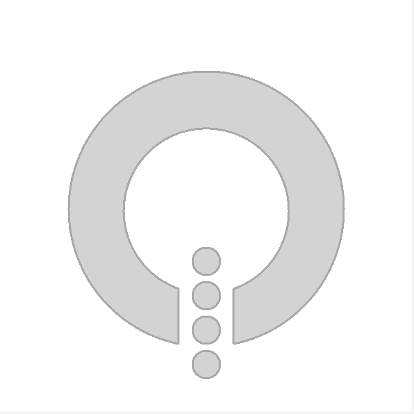

# A Basic Shape

The shape module lets you create arbitrarily paths and then stroke the outline and fill the interior. The definition of the path can be reused in other places where paths are used, e.g. for the ``PathView`` element used with models. But to paint a path, the ``Shape`` element is used, and the various path elements are put into a ``ShapePath``.

In the example below, the path shown in the screenshot here is created. The entire figure, all five filled areas, are created from a single path which then is stroked and filled.

<<< @/docs/ch09-shapes/src/shapes/basic.qml#global

The path is made up of the children to the ``ShapePath``, i.e. the ``PathArc``, ``PathLine``, and ``PathMove`` elements in the example above. In the next section, we will have a close look at the building blocks of paths.
