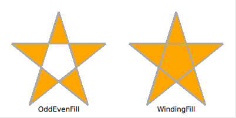
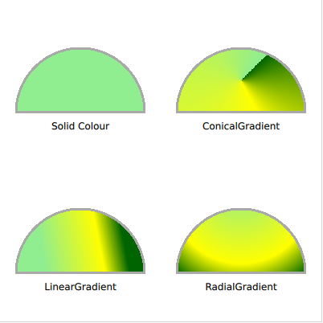

# Filling Shapes

A shape can be filled in a number of different ways. In this section we will have a look at the general filling rule, and also the various ways a path can be filled.

Qt Quick Shapes provides two filling rules controlled using the ``fillRule`` property of the ``ShapePath`` element. The different results are shown in the screenshot below. It can be set to either ``ShapePath.OddEvenFill``, which is the default. This fills each part of the path individually, meaning that you can create a shape with holes in it. The alternative rule is the ``ShapePath.WindingFill``, which fills everything between the extreme endpoints on each horizontal line across the shape. Regardless of the filling rule, the shape outline is then drawn using a pen, so even when using the winding fill rule, the outline is drawn inside the shape.

The examples below demonstrate how to use the two fill rules as shown in the screenshot above.

<<< @/docs/ch09-shapes/src/shapes/fillmode.qml#oddeven
<<< @/docs/ch09-shapes/src/shapes/fillmode.qml#winding

Once the filling rule has been decided on, there are a number of ways to fill the outline. The various options are shown in the screenshot below. The various options are either a solid color, or one of the three gradients provided by Qt Quick.

To fill a shape using a solid color, the ``fillColor`` property of the ``ShapePath`` is used. Set it to a color name or code, and the shape is filled using it.

<<< @/docs/ch09-shapes/src/shapes/gradients.qml#solid

If you do not want to use a solid color, a gradient can be used. The gradient is applied using the ``fillGradient`` property of the ``ShapePath`` element.

The first gradient we look at is the ``LinearGradient``. It creates a linear gradient between the start and end point. The end points can be positioned anyway you like, to create, for instance, a gradient at an angle. Between the end points, a range of ``GradientStop`` elements can be inserted. These are put at a ``position`` from ``0.0``, being the ``x1, y1`` position, to ``1.0``, being the ``x2, y2`` position. For each such stop, a color is specified. The gradient then creates soft transitions between the colors. 

:::tip
If the shape extends beyond the end points, the first or last color is either continued, or the gradient is repeated or mirrored. This behaviour is specified using the ``spread`` property of the ``LinearGradient`` element.
:::

<<< @/docs/ch09-shapes/src/shapes/gradients.qml#linear

To create a gradient that spreads around an origin, a bit like a clock, the ``ConicalGradient`` is used. Here, the center point is specified using the ``centerX`` and ``centerY`` properties, and the starting angle is given using the ``angle`` property. The gradient stops are then spread from the given angle in a clockwise direction for 360 degrees.

<<< @/docs/ch09-shapes/src/shapes/gradients.qml#conical

To instead create a gradient that forms circles, a bit like rings on the water, the ``RadialGradient`` is used. For it you specify two circles, the focal circle and the center. The gradient stops go from the focal circle to the center circle, and beyond those circles, the last color continues, is mirrored or repeats, depending on the ``spread`` property.

<<< @/docs/ch09-shapes/src/shapes/gradients.qml#radial

:::tip
The advanced user can use a fragment shader to fill a shape. This way, you have full freedom to how the shape is filled. See the Effects chapter for more information on shaders.
