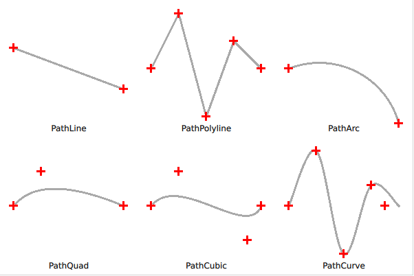

# Building Paths

As we saw in the last section, shapes are built from paths, which are built from path elements. The most common way to build a path is to close it, i.e. to ensure that it starts and ends in the same point. However, it is possible to create open paths, e.g. only for stroking. When filling an open path, the path is closed by a straight line, basically adding a ``PathLine`` that is used when filling the path, but not when stroking it.

As shown in the screenshot below, there are a few basic shapes that can be used to build your path. These are: lines, arcs, and various curves. It is also possible to move without drawing using a ``PathMove`` element. In addition to these elements, the ``ShapePath`` element also lets you specify a starting point using the ``startX`` and ``startY`` properties.

Lines are drawn using the ``PathLine`` element, as shown below. For creating multiple independent lines, the ``PathMultiline`` can be used.

<<< @/docs/ch09-shapes/src/shapes/paths.qml#line

When creating a polyline, i.e. a line consisting of several line segments, the ``PathPolyline`` element can be used. This saves some typing, as the end point of the last line is assumed to be the starting point of the next line.

<<< @/docs/ch09-shapes/src/shapes/paths.qml#polyline

For creating arcs, i.e. segments of circles or ellipses, the ``PathArc`` and ``PathAngleArc`` elements are used. They provide you with the tools to create arcs, where the ``PathArc`` is used when you know the coordinates of the starting and ending points, while the ``PathAngleArc`` is useful when you want to control how many degrees the arc sweeps. Both elements produce the same output, so which one you use comes down to what aspects of the arc are the most important in your application.

<<< @/docs/ch09-shapes/src/shapes/paths.qml#arc

After the lines and arcs follows the various curves. Here, Qt Quick Shapes provides three flavours. First, we have a look a the ``PathQuad`` which let's you create a quadratic Bezier curve based on the starting and end points (the starting point is implicit) and a single control point.

<<< @/docs/ch09-shapes/src/shapes/paths.qml#quad

The ``PathCubic`` element creates a cubic Bezier curve from the starting and end points (the starting point is implicit) and two control points.

<<< @/docs/ch09-shapes/src/shapes/paths.qml#cubic

Finally, the ``PathCurve`` creates a curve passing through a list of provided control points. The curve is created by providing multiple ``PathCurve`` elements which each contain one control point. The Catmull-Rom spline is used to create a curve passing through the control points.

<<< @/docs/ch09-shapes/src/shapes/paths.qml#curve

There is one more useful path element, the ``PathSvg``. This element lets you stroke and fill an SVG path.

:::tip
The ``PathSvg`` element cannot always be combined with other path elements. This depends on the painting backend used, so make sure to use the ``PathSvg`` element or the other elements for a single path. If you mix ``PathSvg`` with other path elements, your mileage will vary.
