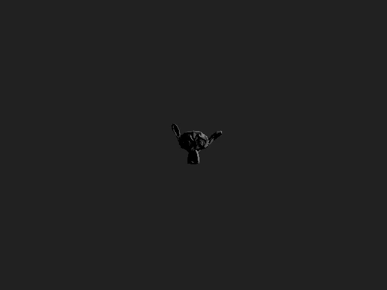
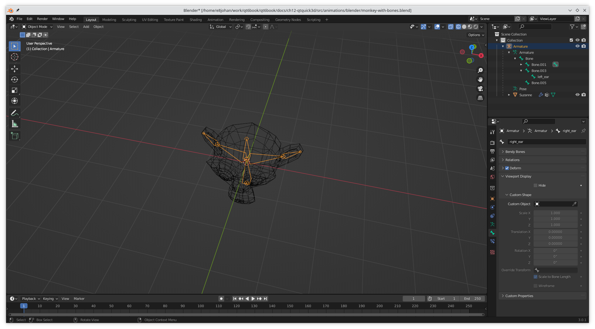

# Animations

There are multiple ways to add animations to Qt Quick 3D scenes. The most basic one is to move, rotate, and scale ``Model`` elements in the scene. However, in many cases, we want to modify the actual meshes. There are two basic approaches to this: morphing animations and skeletal animations.

Morphing animations lets you create a number of target shapes to which various weights can be assigned. By combining the target shapes based on the weights, a deformed, i.e. morphed, shape is produced. This is commonly used to simulate deformations of soft materials.

Skeletal animations is used to pose an object, such as a body, based on the positions of a skeleton made of bones. These bones will affect the body, thus deform it into the pose required.

For both types of animations, the most common approach is to define the morphing target shapes and bones in a modelling tool, and then export it to QML using the _Balsam_ tool. In this chapter we will do just this for a skeletal animation, but the approach is similar for a morphing animation.

# Skeletal Animations

The goal of this example is to make Suzanne, the Blender monkey head, wave with one of her ears.



Skeletal animation is sometimes known as vertex skinning. Basically, a skeleton is put inside of a mesh and the vertexes of the mesh are bound to the skeleton. This way, when moving the skeleton, the mesh is deformed into various poses.

As teaching Blender is beyond the scope of this book, the keywords you are looking for are posing and armatures. Armatures are what Blender calls the bones. There are plenty of video tutorials available explaining how to do this. The screenshot below shows the scene with Suzanne and the armatures in Blender. Notice that the ear armatures have been named, so that we can identify them from QML.



Once the Blender scene is done, we export it as a COLLADA file and convert it to a QML and a mesh, just as in the _Working with Assets_ section. The resulting QML file is called ``Monkey_with_bones.qml``.

We then have to refer to the files in our ``qt_add_qml_module`` statement in the ``CMakeLists.txt`` file:

```
qt_add_qml_module(appanimations
    URI animations
    VERSION 1.0
    QML_FILES main.qml Monkey_with_bones.qml
    RESOURCES meshes/suzanne.mesh
)
```

Exploring the generated QML, we notice that the skeleton is built up from QML elements of the types ``Skeleton`` and ``Joint``. It is possible to work with these elements as code in QML, but it is much more common to create them in a design tool.

<<< @/docs/ch12-qtquick3d/src/animations/Monkey_with_bones.qml#armature

The ``Skeleton`` element is then referred to by the ``skeleton`` property of the ``Model`` element, before the ``inverseBindPoses`` property, linking the joints to the model.

<<< @/docs/ch12-qtquick3d/src/animations/Monkey_with_bones.qml#model

The next step is to include the newly created ``Monkey_with_bones`` element into our main ``View3D`` scene:

<<< @/docs/ch12-qtquick3d/src/animations/main.qml#monkey

And then we create a ``SequentialAnimation`` built from two ``NumberAnimations`` to make the ear flop forth and back.

<<< @/docs/ch12-qtquick3d/src/animations/main.qml#animation

::: tip Caveat
In order to be able to access the ``Joint``'s ``eulerRotation.y`` from outside of the ``Monkey_with_bones`` file, we need to expose it as a top level property alias. This means modifying a generated file, which is not very nice, but it solves the problem.

<<< @/docs/ch12-qtquick3d/src/animations/Monkey_with_bones.qml#hack
:::

The resulting floppy ear can be enjoyed below:


As you can see, it is convenient to import and use skeletons created in a design tool. This makes it convenient to animate complex 3D models from QML.
