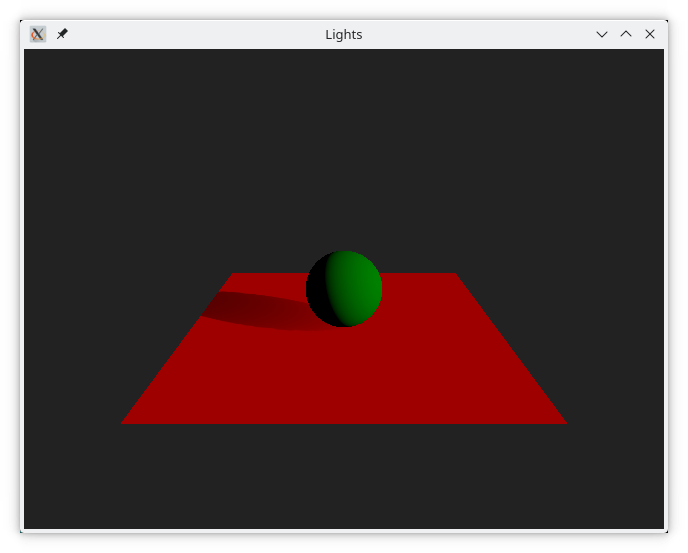
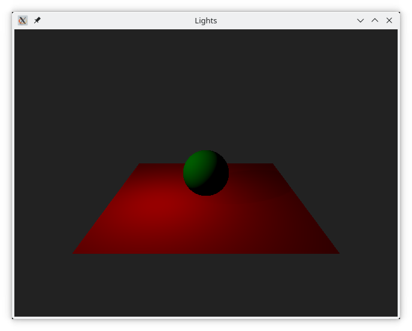
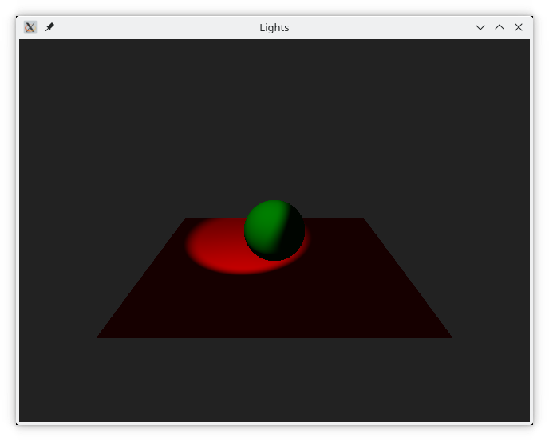
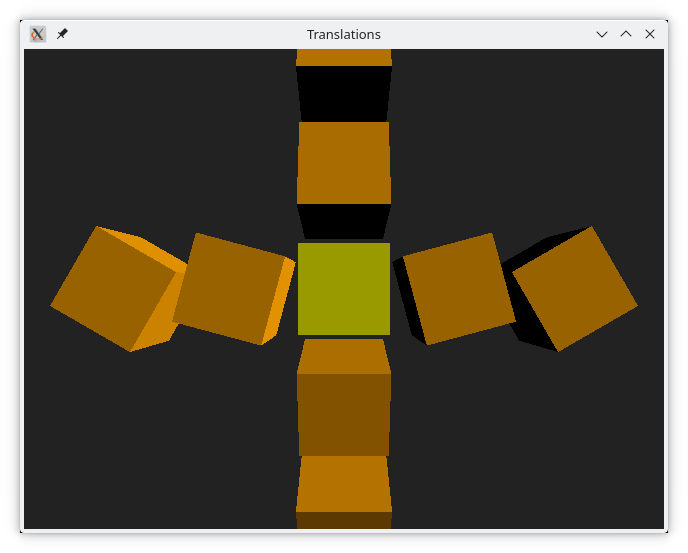

# The Basics

## A Basic Scene

- View
- scene environment
- camera
- light
- model / meshes

    
<<< @/docs/ch12-qtquick3d/src/basicscene/main.qml

## The Built-in Meshes

<<< @/docs/ch12-qtquick3d/src/meshes/main.qml

## Lights

<<< @/docs/ch12-qtquick3d/src/lights/main.qml

## Transformations

<<< @/docs/ch12-qtquick3d/src/translations/main.qml

- scale
- translate
- order
