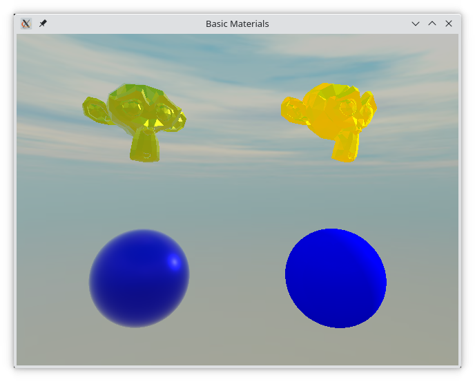
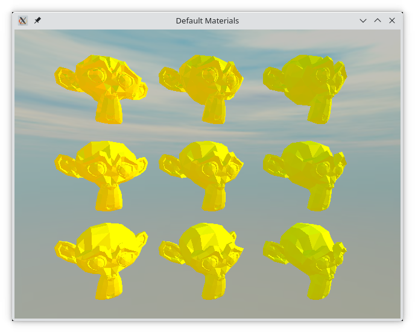
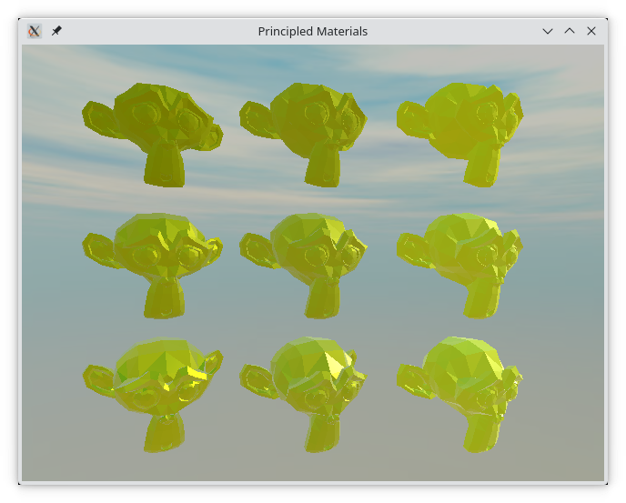

# Materials and Light

Up until now, we've only worked with basic materials. To create a convincing 3D scene, proper materials and more advanced lighting is needed. Qt Quick 3D supports a number of techniques to achieve this, and in this section we will look at a few of them.

## The Built-in Materials

First up, we will look at the built in materials. Qt Quick 3D comes with three material types: ``DefaultMaterial``, ``PrincipledMaterial``, and ``CustomMaterial``. In this chapter we will touch on the two first, while the latter allows you to create truly custom material by providing your own vertex and fragment shaders.

The ``DefaultMaterial`` lets you control the appearance of the material through the ``specular``, ``roughness``, and ``diffuseColor`` properties. The ``PrincipledMaterial`` lets you control the appearache through the ``metalness``, ``roughness``, and ``baseColor`` properties.

Examples of the two material types can be seen below, with the ``PrincipledMaterial`` to the left, and the ``DefaultMaterial`` to the right.

Comparing the two Suzannes, we can see how the two materials are set up.

For the ``DefaultMaterial``, we use the ``diffuseColor``, ``specularTint``, and ``specularAmount`` properties. We will look at how variations of these properties affect the appearance of the objects later in this section.

<<< @/docs/ch12-qtquick3d/src/basicmaterials/main.qml#suzannedefault

For the ``PrincipledMaterial``, we tune the ``baseColor``, ``metalness``, and ``roughness``properties. Again, we will look at how variations of these properties affect the appearance later in this section.

<<< @/docs/ch12-qtquick3d/src/basicmaterials/main.qml#suzanneprincipled

### Default Material Properties

The figure below shows the default material with various values for the ``specularAmount`` and the ``specularRoughness`` properties.

The ``specularAmount`` varies from ``0.8`` (left-most), through ``0.5`` (center), to ``0.2`` (right-most).

The ``specularRoughness`` varies from ``0.0`` (top), through ``0.4`` (middle), to ``0.8`` (bottom).

The code for the middle ``Model`` is shown below.

<<< @/docs/ch12-qtquick3d/src/defaultmaterial/main.qml#middle

### Principled Material Properties

The figure below shows the principled material with various values for the ``metalness`` and ``roughness``properties.

The ``metalness`` varies from ``0.8`` (left-most), through ``0.5`` (center), to ``0.2`` (right-most).

The ``roughness`` varies from ``0.9`` (top), through ``0.6`` (middle), to ``0.3`` (bottom).

<<< @/docs/ch12-qtquick3d/src/principledmaterial/main.qml#middle

## Image-based Lighting

One final detail in the main example in this section is the skybox. For this example, we are using an image as skybox, instead of a single colour background.

To provide a skybox, assign a ``Texture``to the ``lightProbe`` property of the ``SceneEnvironment`` as shown in the code below. This means that the scene receives image-based light, i.e. that the skybox is used to light the scene. We also adjust the ``probeExposure`` which is used to control how much light is exposed through the probe, i.e. how brightly the scene will be lit. In this scene, we combine the light probe with a ``DirectionalLight`` for the final lighting.

<<< @/docs/ch12-qtquick3d/src/basicmaterials/main.qml#skybox

In addition to what we show, the orientation of the light probe can be adjusted using the ``probeOrientation`` vector, and the ``probeHorizon`` property can be used to darken the bottom half of the environment, simulating that the light comes from above, i.e. from the sky, rather than from all around.
