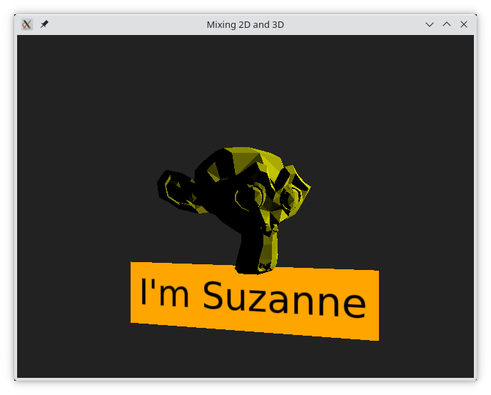

# Mixing 2D and 3D Contents

Qt Quick 3D has been built to integrate nicely into the traditional Qt Quick used to build dynamic 2D contents.

## 3D Contents in a 2D Scene

It is straight forward to mix 3D contents into a 2D scene, as the ``View3D`` element represents a 2D surface in the Qt Quick scene.

There are a couple of properties that can be of interest when combining 3D contents into a 2D scene this way. 

First, the ``renderMode`` of ``View3D``, which lets you control if the 3D contents is rendered behind, in-front-of, or inline with the 2D contents. It can also be rendered on an off-screen buffer which then is combined with the 2D scene.

The other property is the ``backgroundMode`` of the ``SceneEnvironment`` bound to the ``environment`` property of the ``View3D``. Ẁe've seen it set to ``Color`` or ``SkyBox``, but it can also be set to ``Transparent`` which lets you see any 2D contents behind the ``View3D`` through the 3D scene.

When building a combined 2D and 3D scene, it is also good to know that it is possible to combine multiple ``View3D`` elements in a single Qt Quick scene. For instance, if you want to have multiple 3D models in a single scene, but they are separate parts of the 2D interface, then you can put them in separate ``View3D`` elements and handle the layout from the 2D Qt Quick side.

## 2D Contents in a 3D Scene

To put 2D contents into a 3D scene, it needs to be placed on a 3D surface. The Qt Quick 3D ``Texture`` element has a ``sourceItem`` property that allows you to integrate a 2D Qt Quick scene as a texture for an arbitrary 3D surface.

Another apporoach is to put the 2D Qt Quick elements directly into the scene. This is the approach used in the example below where we provide a name badge for Suzanne.

What we do here is that we instantiate a ``Node`` that serves as an anchor point in the 3D scene. We then place a ``Rectangle`` and a ``Text`` element inside the ``Node``. These two are 2D Qt Quick elements. We can then control the 3D position, rotation, and scale through the corresponding properties of the ``Node`` element.

<<< @/docs/ch12-qtquick3d/src/mix2d3d/main.qml#2dnode
