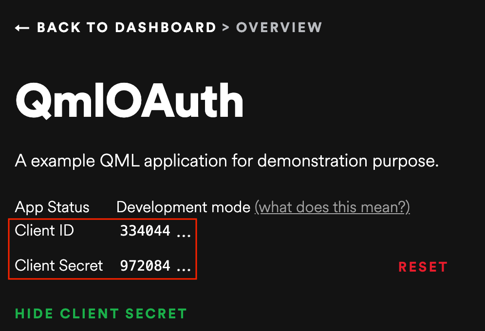
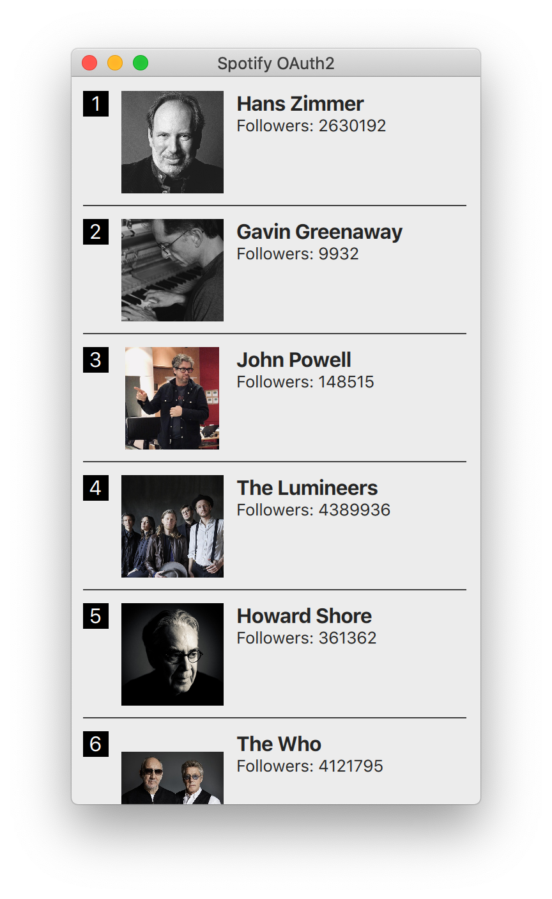

# Authentication using OAuth

OAuth is an open protocol to allow secure authorization in a simple and standard method from web, mobile, and desktop applications. OAuth is used to authenticate a client against common web-services such as Google, Facebook, and Twitter.

::: tip
For a custom web-service you could also use the standard HTTP authentication for example by using the `XMLHttpRequest` username and password in the get method (e.g. `xhr.open(verb, url, true, username, password)`)
:::

OAuth is currently not part of a QML/JS API. So you would need to write some C++ code and export the authentication to QML/JS. Another issue would be the secure storage of the access token.

Here are some links which we find useful:

* [http://oauth.net/](http://oauth.net/)
* [http://hueniverse.com/oauth/](http://hueniverse.com/oauth/)
* [https://github.com/pipacs/o2](https://github.com/pipacs/o2)
* [http://www.johanpaul.com/blog/2011/05/oauth2-explained-with-qt-quick/](http://www.johanpaul.com/blog/2011/05/oauth2-explained-with-qt-quick/)

## Integration example

In this section, we will go through an example of OAuth integration using the [Spotify API](https://developer.spotify.com/documentation/web-api/). This example uses a combination of C++ classes and QML/JS. To discover more on this integration, please refer to Chapter 16.

This application's goal is to retrieve the top ten favourite artists of the authenticated user.

### Creating the App

First, you will need to create a dedicated app on the [Spotify Developer's portal](https://developer.spotify.com/dashboard/applications). 


Once your app is created, you'll receive two keys: a `client id` and a `client secret`. 



### The QML file

The process is divided in two phases:

1. The application connects to the Spotify API, which in turns requests the user to authorize it;
2. If authorized, the application displays the list of the top ten favourite artists of the user.

#### Authorizing the app

Let's start with the first step:

<<< @/docs/ch13-networking/src/oauth/main.qml#imports

When the application starts, we will first import a custom library, `Spotify`, that defines a `SpotifyAPI` component (we'll come to that later). This component will then be instantiated:

<<< @/docs/ch13-networking/src/oauth/main.qml#setup

Once the application has been loaded, the `SpotifyAPI` component will request an authorization to Spotify:

<<< @/docs/ch13-networking/src/oauth/main.qml#on-completed

Until the authorization is provided, a busy indicator will be displayed in the center of the app.

:::tip
Please note that for security reasons, the API credentials should never be put directly into a QML file!
:::

#### Listing the user's favorite artists

The next step happens when the authorization has been granted. To display the list of artists, we will use the Model/View/Delegate pattern:

<<< @/docs/ch13-networking/src/oauth/main.qml#model-view{3,10,13,22,42,51,57,61}

The model `SpotifyModel` is defined in the `Spotify` library. To work properly, it needs a `SpotifyAPI`.

The ListView displays a vertical list of artists. An artist is represented by a name, an image and the total count of followers.

### SpotifyAPI

Let's now get a bit deeper into the authentication flow. We'll focus on the `SpotifyAPI` class, a `QML_ELEMENT` defined on the C++ side.


```cpp
#ifndef SPOTIFYAPI_H
#define SPOTIFYAPI_H

#include <QtCore>
#include <QtNetwork>
#include <QtQml/qqml.h>

#include <QOAuth2AuthorizationCodeFlow>

class SpotifyAPI: public QObject
{
    Q_OBJECT
    QML_ELEMENT

    Q_PROPERTY(bool isAuthenticated READ isAuthenticated WRITE setAuthenticated NOTIFY isAuthenticatedChanged)

public:
    SpotifyAPI(QObject *parent = nullptr);

    void setAuthenticated(bool isAuthenticated) {
        if (m_isAuthenticated != isAuthenticated) {
            m_isAuthenticated = isAuthenticated;
            emit isAuthenticatedChanged();
        }
    }

    bool isAuthenticated() const {
        return m_isAuthenticated;
    }

    QNetworkReply* getTopArtists();

public slots:
    void setCredentials(const QString& clientId, const QString& clientSecret);
    void authorize();

signals:
    void isAuthenticatedChanged();

private:
    QOAuth2AuthorizationCodeFlow m_oauth2;
    bool m_isAuthenticated;
};

#endif // SPOTIFYAPI_H
```

First, we'll import the `<QOAuth2AuthorizationCodeFlow>` class. This class is a part of the `QtNetworkAuth` module, which contains various implementations of `OAuth`.

```cpp
#include <QOAuth2AuthorizationCodeFlow>
```

Our class, `SpotifyAPI`, will define a `isAuthenticated` property:

```cpp
Q_PROPERTY(bool isAuthenticated READ isAuthenticated WRITE setAuthenticated NOTIFY isAuthenticatedChanged)
```

The two public slots that we used in the QML files:

```cpp
void setCredentials(const QString& clientId, const QString& clientSecret);
void authorize();
```

And a private member representing the authentication flow:

```cpp
QOAuth2AuthorizationCodeFlow m_oauth2;
```

On the implementation side, we have the following code:

```cpp
#include "spotifyapi.h"

#include <QtGui>
#include <QtCore>
#include <QtNetworkAuth>

SpotifyAPI::SpotifyAPI(QObject *parent): QObject(parent), m_isAuthenticated(false) {
    m_oauth2.setAuthorizationUrl(QUrl("https://accounts.spotify.com/authorize"));
    m_oauth2.setAccessTokenUrl(QUrl("https://accounts.spotify.com/api/token"));
    m_oauth2.setScope("user-top-read");

    m_oauth2.setReplyHandler(new QOAuthHttpServerReplyHandler(8000, this));
    m_oauth2.setModifyParametersFunction([&](QAbstractOAuth::Stage stage, QMultiMap<QString, QVariant> *parameters) {
        if(stage == QAbstractOAuth::Stage::RequestingAuthorization) {
            parameters->insert("duration", "permanent");
        }
    });

    connect(&m_oauth2, &QOAuth2AuthorizationCodeFlow::authorizeWithBrowser, &QDesktopServices::openUrl);
    connect(&m_oauth2, &QOAuth2AuthorizationCodeFlow::statusChanged, [=](QAbstractOAuth::Status status) {
        if (status == QAbstractOAuth::Status::Granted) {
            setAuthenticated(true);
        } else {
            setAuthenticated(false);
        }
    });
}

void SpotifyAPI::setCredentials(const QString& clientId, const QString& clientSecret) {
    m_oauth2.setClientIdentifier(clientId);
    m_oauth2.setClientIdentifierSharedKey(clientSecret);
}

void SpotifyAPI::authorize() {
    m_oauth2.grant();
}

QNetworkReply* SpotifyAPI::getTopArtists() {
    return m_oauth2.get(QUrl("https://api.spotify.com/v1/me/top/artists?limit=10"));
}
```

The constructor task mainly consists in configuring the authentication flow. First, we define the Spotify API routes that will serve as authenticators.

```cpp
m_oauth2.setAuthorizationUrl(QUrl("https://accounts.spotify.com/authorize"));
m_oauth2.setAccessTokenUrl(QUrl("https://accounts.spotify.com/api/token"));
```

We then select the scope (= the Spotify authorizations) that we want to use:

```cpp
m_oauth2.setScope("user-top-read");
````

Since OAuth is a two-way communication process, we instantiate a dedicated local server to handle the replies:

```cpp
m_oauth2.setReplyHandler(new QOAuthHttpServerReplyHandler(8000, this));
```

Finally, we configure two signals and slots.

```cpp
connect(&m_oauth2, &QOAuth2AuthorizationCodeFlow::authorizeWithBrowser, &QDesktopServices::openUrl);
connect(&m_oauth2, &QOAuth2AuthorizationCodeFlow::statusChanged, [=](QAbstractOAuth::Status status) { /* ... */ })
```

The first one configures the authorization to happen within a web-browser (through `&QDesktopServices::openUrl`), while the second makes sure that we are notified when the authorization process has been completed.

The `authorize()` method is only a placeholder for calling the underlying `grant()` method of the authentication flow. This is the method that triggers the process.

```cpp
void SpotifyAPI::authorize() {
    m_oauth2.grant();
}
```

Finally, the `getTopArtists()` calls the web api using the authorization context provided by the `m_oauth2` network access manager.

```cpp
QNetworkReply* SpotifyAPI::getTopArtists() {
    return m_oauth2.get(QUrl("https://api.spotify.com/v1/me/top/artists?limit=10"));
}
```

### The Spotify model

This class is a `QML_ELEMENT` that subclasses `QAbstractListModel` to represent our list of artists. It relies on `SpotifyAPI` to gather the artists from the remote endpoint.

```cpp
#ifndef SPOTIFYMODEL_H
#define SPOTIFYMODEL_H

#include <QtCore>

#include "spotifyapi.h"

QT_FORWARD_DECLARE_CLASS(QNetworkReply)

class SpotifyModel : public QAbstractListModel
{
    Q_OBJECT
    QML_ELEMENT

    Q_PROPERTY(SpotifyAPI* spotifyApi READ spotifyApi WRITE setSpotifyApi NOTIFY spotifyApiChanged)

public:
    SpotifyModel(QObject *parent = nullptr);

    void setSpotifyApi(SpotifyAPI* spotifyApi) {
        if (m_spotifyApi != spotifyApi) {
            m_spotifyApi = spotifyApi;
            emit spotifyApiChanged();
        }
    }

    SpotifyAPI* spotifyApi() const {
        return m_spotifyApi;
    }

    enum {
        NameRole = Qt::UserRole + 1,
        ImageURLRole,
        FollowersCountRole,
        HrefRole,
    };

    QHash<int, QByteArray> roleNames() const override;

    int rowCount(const QModelIndex &parent) const override;
    int columnCount(const QModelIndex &parent) const override;
    QVariant data(const QModelIndex &index, int role) const override;

signals:
    void spotifyApiChanged();
    void error(const QString &errorString);

public slots:
    void update();

private:
    QPointer<SpotifyAPI> m_spotifyApi;
    QList<QJsonObject> m_artists;
};

#endif // SPOTIFYMODEL_H
```

This class defines a `spotifyApi` property:

```cpp
Q_PROPERTY(SpotifyAPI* spotifyApi READ spotifyApi WRITE setSpotifyApi NOTIFY spotifyApiChanged)
```

An enumeration of Roles (as per `QAbstractListModel`):

```cpp
enum {
    NameRole = Qt::UserRole + 1,    // The artist's name
    ImageURLRole,                   // The artist's image
    FollowersCountRole,             // The artist's followers count
    HrefRole,                       // The link to the artist's page
};
```

A slot to trigger the refresh of the artists list:

```cpp
public slots:
    void update();
```

And, of course, the list of artists, represented as JSON objects:

```cpp
public slots:
    QList<QJsonObject> m_artists;
```

On the implementation side, we have:

```cpp
#include "spotifymodel.h"

#include <QtCore>
#include <QtNetwork>

SpotifyModel::SpotifyModel(QObject *parent): QAbstractListModel(parent) {}

QHash<int, QByteArray> SpotifyModel::roleNames() const {
    static const QHash<int, QByteArray> names {
        { NameRole, "name" },
        { ImageURLRole, "imageURL" },
        { FollowersCountRole, "followersCount" },
        { HrefRole, "href" },
    };
    return names;
}

int SpotifyModel::rowCount(const QModelIndex &parent) const {
    Q_UNUSED(parent);
    return m_artists.size();
}

int SpotifyModel::columnCount(const QModelIndex &parent) const {
    Q_UNUSED(parent);
    return m_artists.size() ? 1 : 0;
}

QVariant SpotifyModel::data(const QModelIndex &index, int role) const {
    Q_UNUSED(role);
    if (!index.isValid())
        return QVariant();

    if (role == Qt::DisplayRole || role == NameRole) {
        return m_artists.at(index.row()).value("name").toString();
    }

    if (role == ImageURLRole) {
        const auto artistObject = m_artists.at(index.row());
        const auto imagesValue = artistObject.value("images");

        Q_ASSERT(imagesValue.isArray());
        const auto imagesArray = imagesValue.toArray();
        if (imagesArray.isEmpty())
            return "";

        const auto imageValue = imagesArray.at(0).toObject();
        return imageValue.value("url").toString();
    }

    if (role == FollowersCountRole) {
        const auto artistObject = m_artists.at(index.row());
        const auto followersValue = artistObject.value("followers").toObject();
        return followersValue.value("total").toInt();
    }

    if (role == HrefRole) {
        return m_artists.at(index.row()).value("href").toString();
    }

    return QVariant();
}

void SpotifyModel::update() {
    if (m_spotifyApi == nullptr) {
        emit error("SpotifyModel::error: SpotifyApi is not set.");
        return;
    }

    auto reply = m_spotifyApi->getTopArtists();

    connect(reply, &QNetworkReply::finished, [=]() {
        reply->deleteLater();
        if (reply->error() != QNetworkReply::NoError) {
            emit error(reply->errorString());
            return;
        }

        const auto json = reply->readAll();
        const auto document = QJsonDocument::fromJson(json);

        Q_ASSERT(document.isObject());
        const auto rootObject = document.object();
        const auto artistsValue = rootObject.value("items");

        Q_ASSERT(artistsValue.isArray());
        const auto artistsArray = artistsValue.toArray();
        if (artistsArray.isEmpty())
            return;

        beginResetModel();
        m_artists.clear();
        for (const auto artistValue : qAsConst(artistsArray)) {
            Q_ASSERT(artistValue.isObject());
            m_artists.append(artistValue.toObject());
        }
        endResetModel();
    });
}
```

The `update()` method calls the `getTopArtists()` method and handle its reply by extracting the individual items from the JSON document and refreshing the list of artists within the model.

```cpp
auto reply = m_spotifyApi->getTopArtists();

connect(reply, &QNetworkReply::finished, [=]() {
    reply->deleteLater();
    if (reply->error() != QNetworkReply::NoError) {
        emit error(reply->errorString());
        return;
    }

    const auto json = reply->readAll();
    const auto document = QJsonDocument::fromJson(json);

    Q_ASSERT(document.isObject());
    const auto rootObject = document.object();
    const auto artistsValue = rootObject.value("items");

    Q_ASSERT(artistsValue.isArray());
    const auto artistsArray = artistsValue.toArray();
    if (artistsArray.isEmpty())
        return;

    beginResetModel();
    m_artists.clear();
    for (const auto artistValue : qAsConst(artistsArray)) {
        Q_ASSERT(artistValue.isObject());
        m_artists.append(artistValue.toObject());
    }
    endResetModel();
});
```

The `data()` method extracts, depending on the requested model role, the relevant attributes of an Artist and returns as a `QVariant`:

```cpp
    if (role == Qt::DisplayRole || role == NameRole) {
        return m_artists.at(index.row()).value("name").toString();
    }

    if (role == ImageURLRole) {
        const auto artistObject = m_artists.at(index.row());
        const auto imagesValue = artistObject.value("images");

        Q_ASSERT(imagesValue.isArray());
        const auto imagesArray = imagesValue.toArray();
        if (imagesArray.isEmpty())
            return "";

        const auto imageValue = imagesArray.at(0).toObject();
        return imageValue.value("url").toString();
    }

    if (role == FollowersCountRole) {
        const auto artistObject = m_artists.at(index.row());
        const auto followersValue = artistObject.value("followers").toObject();
        return followersValue.value("total").toInt();
    }

    if (role == HrefRole) {
        return m_artists.at(index.row()).value("href").toString();
    }
```




