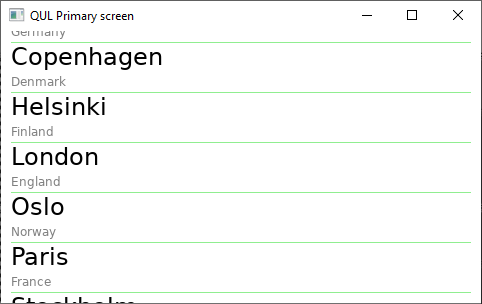

# Working with Models

In Qt Quick Ultralite, it is possible to create models in QML using the ``ListModel`` element. It is also possible, and a bit more interesting, to create models from C++. This lets you expose lists of data from C++ to QML and to instantiate user interface elements for each item of the list. The setup is very similar to the ordinary Qt Quick, but the base classes and interfaces are more limited.

In this chapter we will create a list of cities in Europe, listing the name of the city and the country in which the city is located. The cities will be shown in a ``ListView`` as shown below:

## The C++

To create a model in Qt Quick Ultralite, the first thing we need to do is to define a ``struct`` with the data of each list item. For this struct, we also need to provide a ``==`` operator. This is what we do with the ``CityData`` struct shown below. Notice that we use ``std::string`` rather than ``QString`` in Qt Quick Ultralite. The assumption is that UTF-8 encoding is used.

<<< @/docs/ch19-qtformcu/src/cppmodel/citymodel.h#data

Once the data type has been prepared, we declare the ``CityModel`` struct, inheriting from ``Qul::ListModel``. This lets us define a model that can be accessed from QML. We must implement the ``count`` and ``data`` methods, which are similar, but not identical to, the corresponding methods from the ``QAbstractListModel`` class. We also use the `CMake macro ``qul_target_generate_interfaces`` to make the types available to QML.

<<< @/docs/ch19-qtformcu/src/cppmodel/citymodel.h#model

We also implement a constructor for the ``CityModel`` struct that populates the ``m_data`` vector with data.

<<< @/docs/ch19-qtformcu/src/cppmodel/citymodel.cpp#global

## The QML

In the example, we show the model as a scrollable list, as shown below.

The QML code is shown in its entirety below:

<<< @/docs/ch19-qtformcu/src/cppmodel/cppmodel.qml#global

The example starts by instantiating the ``cityModel``. As the model is not a singleton, it has to be instantiated from QML.

Then the delegate, ``cityDelegate`` is implemented as a ``Component``. This means that it can be instantiated multiple times from QML. The model data is accessed via the ``model.name`` and ``model.country`` attached properties.

Finally, the ``ListView`` element joins the model and the delegate, resulting in the list shown in the screenshots in this chapter.

::: warning TODO
* `ListModel<T> = var`
* ListModel is read-only
* Qul::ListModel
* Custom main
:::
