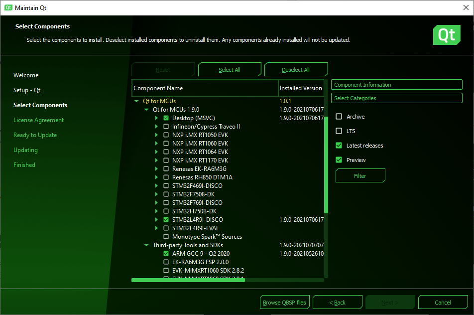

# Setup

[Qt for MCUs](https://doc.qt.io/QtForMCUs/index.html) comes with support for a range of evaluation boards from companies such as NCP, Renesas, ST, and Infinion/Cypress. These are good for getting started and helps you try out the integration to the specific MCU. In the end, you will most likely end up tuning a specific platform definition to your specific hardware, e.g. to configure the amount of RAM, FLASH and screen configuration.

In addition to supporting multiple MCUs out of the box, Qt for MCUs also support running either on FreeRTOS or directly on the bare metal, i.e. without an operating system. As Qt for MCUs focuses on the graphical front-end part of things, there are no classes for filesystems and such. All this has to come from the underlying system. Hence, if you need support for more complex feature, FreeRTOS is one option.

When it comes to the development environment, various boards come with various compilers, so the Qt for MCUs setup will look a bit different depending on which MCU you target, as well as which compiler you choose. For instance, for the boards from ST, both GCC and IAR are supported, while for some other boards Green Hills MULTI Compiler is used. The officially supported development hosts from Qt's point of view are Linux (Ubuntu 20.04 LTS on x86_64) or Windows (Windows 10 on x86_64). For Windows, please notice that the MSVC compilers supported are the 2017 and 2019 editions - not the very latest. Make sure to follow the latest [setup instructions on qt.io](https://doc.qt.io/QtForMCUs/qtul-setup-development-host.html) to get a working environment.

Once you have setup your environment, you can find the supported boards as _Kits_ as well as under _Devices - MCU_ under the _Tools - Options..._ menu item in Qt Creator.

::: tip
If you do not find the MCUs tab under Tools, make sure that the Qt for MCUs plugins (McuSupport and BaremetalSupport) are available and activated under _Help - About Plugins..._.
:::

::: tip Links
Further reading at qt.io:

* [Supported boards](https://doc.qt.io/QtForMCUs/qtul-supported-platforms.html)
* [Platform porting guide](https://doc.qt.io/QtForMCUs/platform-porting-guide-introduction.html)
:::
