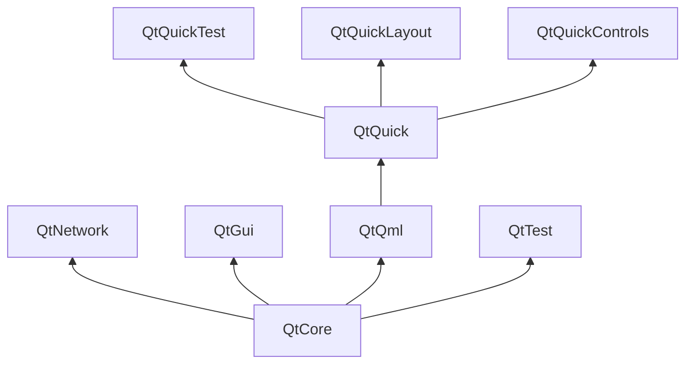

# Qt 构建块

Qt 6 由大量模块组成。通常，模块是供开发人员使用的库。某些模块对于启用 Qt 的平台是必需的，并形成名为 *Qt Essentials Modules* 的集合。其他模块是可选的，形成 *Qt Add-on Modules*。大多数开发人员可能不需要使用后者，但了解它们很好，因为它们为常见挑战提供了宝贵的解决方案。

## Qt 模块

Qt Essentials 模块对于任何支持 Qt 的平台都是必需的。它为使用 Qt Quick 2 开发现代 Qt 6 应用程序奠定了基础。完整的模块列表可在 [Qt 文档模块列表](https://doc.qt.io/qt-6/qtmodules.html#qt-essentials)。

## Core-Essential 模块

用于启动 QML 编程的最小 Qt 6 模块集。

* **Qt Core** - 其他模块使用的核心非图形类。
* **Qt D-BUS** - Linux 上通过 D-Bus 协议进行进程间通信的类。
* **Qt GUI** - 图形用户界面（GUI）组件的基类。包括 OpenGL。
* **Qt Network** - 使网络编程更容易和可移植的类。
* **Qt QML** - QML 和 JavaScript 语言的类。
* **Qt Quick** - 用于构建具有自定义用户界面的高度动态应用程序的声明性框架。
* **Qt Quick Controls** - 提供轻量级 QML 类，用于为桌面、嵌入式和移动设备创建高性能用户界面。这些类采用简单的样式架构并且非常高效。
* **Qt Quick Layouts** - 布局用于在用户界面中排列基于 Qt Quick 2 的项。
* **Qt Quick Test** - QML 应用程序的单元测试框架，其中测试用例编写为 JavaScript 函数。
* **Qt Test** - 用于单元测试 Qt 应用程序和库的类。
* **Qt Widgets** - 使用 C++ 小部件扩展 Qt GUI 的类。

## Qt 附加模块

除了基本模块之外，Qt 还提供了针对特定目的的附加模块。许多附加模块要么功能齐全，能够向后兼容，要么仅适用于某些平台。这里列出了一些可用的附加模块，但请确保你熟悉 [Qt 文档附加模块列表](https://doc.qt.io/qt-6/qtmodules.html#qt-add-ons) 和下面列表中的所有的模块。

* **网络**: Qt Bluetooth / Qt Network Authorization
* **UI 组件**: Qt Quick 3D / Qt Quick Timeline / Qt Charts / Qt Data Visualization / Qt Lottie Animation / Qt Virtual Keyboard
* **图形**: Qt 3D / Qt Image Formats / Qt OpenGL / Qt Shader Tools / Qt SVG / Qt Wayland Compositor
* **助手**: Qt 5 Core Compatibility APIs / Qt Concurrent / Qt Help / Qt Print Support / Qt Quick Widgets / Qt SCXML / Qt SQL / Qt State Machine / Qt UI Tools / Qt XML

::: tip
由于这些模块不是发布的一部分，每个模块的状态可能会有所不同，具体取决于有多少贡献者处于活动状态以及它的测试情况。
:::

## 支持的平台

Qt 支持多种平台，包括所有主要的桌面和嵌入式平台。通过 Qt 应用程序抽象，如果需要，现在可以比以往更轻松地将 Qt 移植到您自己的平台。

在一个平台上测试 Qt 6 非常耗时。Qt 项目选择了一个平台子集来构建参考平台集。这些平台通过系统测试进行彻底测试，以确保最佳质量。但是，请记住，没有任何代码是没有错误的。

# Qt 项目

来自 [Qt Wiki](http://wiki.qt.io/)：

> “Qt Wiki 是一个对 Qt 感兴趣的基于共识的精英社区，任何人都可以加入这个社区，参与其决策过程，并为 Qt 的开发做出贡献。”

Qt Wiki 是 Qt 用户和贡献者共享内部信息的地方。它形成了其他用户贡献的基础。最大的贡献者是Qt公司，它还拥有Qt的商业权利。

对于公司来说，Qt 既有开源的一面，也有商业的一面。商业方面是针对那些不能或不愿遵守开源许可的公司。如果没有商业方面的考虑，这些公司就不能使用 Qt，也就不允许 Qt 公司为 Qt 项目贡献这么多代码。

全球有许多公司在各种平台上使用 Qt 进行咨询和产品开发。有许多开源项目和开源开发人员都依赖 Qt 作为他们的主要开发库。成为这个充满活力的社区的一员并与这个很棒的工具和库一起工作感觉很好。它会让你成为一个更好的人吗？也许 :-)

**在这里贡献：http://wiki.qt.io/**
