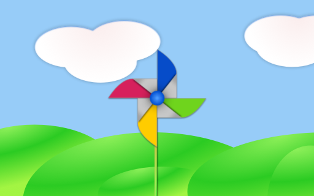

# Qt 6 介绍

## Qt Quick

Qt Quick 是 Qt 6 中用户界面技术的总称。它是在 Qt 5 中引入的，现在在 Qt 6 中进行了扩展。Qt Quick 本身是多种技术的集合：

* QML - 用户界面的标记语言
* JavaScript - 动态脚本语言
* Qt C++ - 高度可移植的增强型 C++ 库


与 HTML 类似，QML 也是一种标记语言。它由标记组成，在 Qt Quick 中称为类型，用大括号括起来：`Item {}`。它是从头开始设计的，旨在为开发人员创建用户界面、快速和更轻松的阅读。可以使用 JavaScript 代码进一步增强用户界面。Qt Quick 可以使用 Qt C++ 轻松为您的开发环境扩展功能。简而言之，声明式 UI 称为前端，原生部分称为后端。这允许您将应用程序的逻辑部分与用户界面部分分开。

在一个典型的项目中，前端是用 QML/JavaScript 开发的。与系统交互并完成繁重工作的后端是使用 Qt C++ 开发的。这使面向设计的开发人员和功能开发人员分离。通常，后端使用 Qt Test（Qt 单元测试框架）进行测试，并导出供前端开发人员使用。

## 分析用户界面

让我们使用 Qt Quick 创建一个简单的用户界面，它展示了 QML 语言的一些功能。最后，我们将完成一个带有旋转叶片的纸风车。



我们从一个名为 `main.qml` 的空文件开始。我们所有的 QML 文件都有后缀 `.qml`。作为一种标记语言（如 HTML），一个 QML 文档需要且只有一个root类型。在我们的例子中，这是具有基于背景图像几何形状的宽度和高度的 `Image` 类型：

```qml
import QtQuick

Image {
    id: root
    source: "images/background.png"
}
```

由于 QML 不限制root类型的类型选择，所以我们使用 `Image` 类型，并将 source 属性设置为我们的背景图像作为root。


::: tip
每种类型都有属性。例如，图像具有属性 `宽度` 和 `高度`，每个属性都包含一个像素数。它还具有其他属性，例如 `source`。由于图片类型的大小是根据图片大小自动导出的，我们不需要自己设置 `width` 和 `height` 属性。
:::

最标准的类型位于 `QtQuick` 模块中，该模块由 `.qml` 文件开头的 import 语句提供。

`id` 是一个特殊的可选属性，它包含一个标识符，可用于在其他地方引用其关联的类型。重要提示：`id` 属性在设置后不能更改，也不能在运行时设置。使用 `root` 作为 root-type 的 id 是本书中使用的规范，以便在较大的 QML 文档中引用最顶层的类型是可预测的。

前景元素，表示用户界面中的杆子和风车，作为单独的图像包含。


我们想要水平地将杆子放置在背景的中心，但是垂直地向底部偏移。我们想把风车放在背景中间。

虽然这个示例只使用图像类型，但随着我们的进展，您将创建由许多不同类型组成的更复杂的用户界面。

```qml
Image {
    id: root
    ...
    Image {
        id: pole
        anchors.horizontalCenter: parent.horizontalCenter
        anchors.bottom: parent.bottom
        source: "images/pole.png"
    }

    Image {
        id: wheel
        anchors.centerIn: parent
        source: "images/pinwheel.png"
    }
    ...
}
```

为了将风车放置在中间，我们使用了一个名为 `anchor` 的复杂属性。锚定允许您指定父对象和子对象之间的几何关系。例如，将我放在另一种类型的中心（`anchors.centerIn: parent`）。两端有left、right、top、bottom、centerIn、fill、verticalCenter和horizontalCenter关系。自然地，当两个或多个锚点一起使用时，它们应该相互补充：例如，将一个类型的左侧锚定到另一个类型的顶部是没有意义的。

对于风车，锚固只需要一个简单的锚。

::: tip
有时你会需要进行微调，例如，将字体稍微偏离中心。这可以通过 `anchors.horizontalCenterOffset` 或 `anchors.verticalCenterOffset` 来完成。类似的调整属性也可用于所有其他锚点。有关锚点属性的完整列表，请参阅文档。
:::

::: tip
将图像作为我们的根类型（`Image`）的子类型说明了声明性语言的一个重要概念。按层和分组的顺序描述用户界面的外观，其中最顶层（我们的背景图像）首先绘制，子层在包含类型的局部坐标系中绘制在其顶部。
:::

为了让展示更有趣，让我们可以和场景交互。这个想法是当用户在场景中的某个地方按下鼠标时旋转滚轮。

我们使用 `MouseArea` 类型并使其覆盖我们根类型的整个区域。

```qml
Image {
    id: root
    ...
    MouseArea {
        anchors.fill: parent
        onClicked: wheel.rotation += 90
    }
    ...
}
```

当用户在其覆盖的区域内单击时，鼠标区域会发出信号。你可以通过编写 `onClicked` 函数来连接到这个信号。当一个信号被连接时，这意味着它所对应的函数（或多个函数）在发出信号时被调用。在这种情况下，我们说当鼠标点击鼠标区域时，`id` 为 `wheel` 的类型（即风车图像）应该旋转+90度。

::: tip
此技术适用于每个信号，命名约定为 `on` + `SignalName`。 此外，所有属性在其值发生变化时都会发出信号。对于这些信号，命名约定是：
:::

```js
    `on${property}Changed`
```

例如，如果更改了 `width` 属性，您可以使用 `onWidthChanged: print(width)` 查看它。

现在只要用户点击，轮子就会旋转，但旋转发生在一次跳跃中，而不是随着时间的流逝而移动。我们可以使用动画来实现平滑的运动。动画定义了属性更改在一段时间内如何发生。为了实现这一点，我们使用名为 `Behavior` 的 `Animation` 类型的属性。`Behavior` 为应用到该属性的每个更改指定一个已定义属性的动画。换句话说，只要属性发生变化，动画就会运行。这只是在 QML 中制作动画的众多方法之一。

```qml
Image {
    id: root
    Image {
        id: wheel
        Behavior on rotation {
            NumberAnimation {
                duration: 250
            }
        }
    }
}
```

现在，每当轮子的旋转属性发生变化时，它将使用持续时间为 250 毫秒的 `NumberAnimation` 进行动画处理。因此，每个 90 度转弯将花费 250 毫秒，从而产生良好的平滑转弯。


::: tip
实际上你不会看到轮子模糊。这只是为了表示旋转。（一个模糊的轮子位于 assets 文件夹中，如果你想尝试使用它。）
:::

现在轮子看起来好多了，性能也很好，并且提供了对 Qt Quick 编程工作原理的非常简要的了解。
