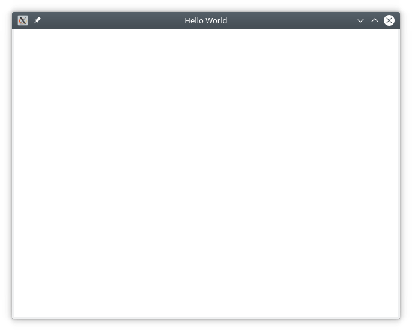

# Hello World

To test your installation, we will create a small *hello world* application. Please, open Qt Creator and create a Qt Quick UI Project ( `File ‣ New File or Project ‣ Other Project ‣ Qt Quick UI prototype` ) and name the project `HelloWorld`.

::: tip
The Qt Creator IDE allows you to create various types of applications. If not otherwise stated, we always use a Qt Quick UI prototype project. For a production application you would often prefer a `CMake` based project, but for fast prototyping this type is better suited.
:::

::: tip
A typical Qt Quick application is made out of a runtime called the QmlEngine which loads the initial QML code. The developer can register C++ types with the runtime to interface with the native code. These C++ types can also be bundled into a plugin and then dynamically loaded using an import statement. The `qml` tool is a pre-made runtime which is used directly. For the beginning, we will not cover the native side of development and focus only on the QML aspects of Qt 6. This is why we start from a prototype project.
:::

Qt Creator creates several files for you. The `HelloWorld.qmlproject` file is the project file, where the relevant project configuration is stored. This file is managed by Qt Creator, so don’t edit it yourself.

Another file, `HelloWorld.qml`, is our application code. Open it and try to understand what the application does before you read on.

```qml
// HelloWorld.qml

import QtQuick
import QtQuick.Window

Window {
    width: 640
    height: 480
    visible: true
    title: qsTr("Hello World")
}
```

The `HelloWord.qml` program is written in the QML language. We’ll discuss the QML language more in-depth in the next chapter. QML describes the user interface as a tree of hierarchical elements. In this case, a window of 640 x 480 pixels, with a window title if “Hello World”.

To run the application on your own, press the  Run tool on the left side, or select Build > Run from the menu.

In the background, Qt Creator runs `qml` and passes your QML document as the first argument. The `qml` application parses the document, and launches the user interface. You should see something like this:



Qt 6 works! That means we’re ready to continue.

::: tip
If you are a system integrator, you’ll want to have Qt SDK installed to get the latest stable Qt release, as well as a Qt version compiled from source for your specific device target.
:::

::: tip
Build from Scratch

If you’d like to build Qt 6 from the command line, you’ll first need to grab a copy of the code repository and build it. Visit Qt’s wiki for an up-to-date explanation of how to build Qt from git.

After a successful compilation (and 2 cups of coffee), Qt 6 will be available in the `qtbase` folder. Any beverage will suffice, however, we suggest coffee for best results.

If you want to test your compilation, you can now run the example with the default runtime that comes with Qt 6:

    $ qtbase/bin/qml
:::

