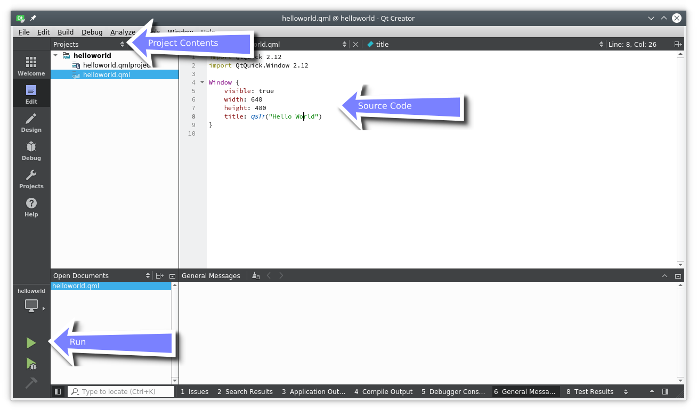

# Using the Editor

When you open a project or you just created a new project Qt Creator will switch to the edit mode. You should see on the left of your project files and in the center area the code editor. Selecting files on the left will open them in the editor. 

The editor provides syntax highlighting, code-completion, and quick-fixes. Also, it supports several commands for code refactoring. When working with the editor you will have the feeling that everything reacts immediately. This is thanks to the developers of Qt Creator which made the tool feel really snappy.

