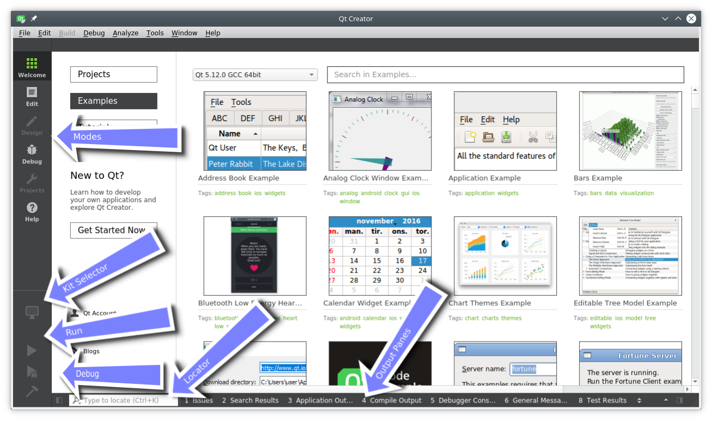

# The User Interface

When starting Qt Creator you are greeted by the *Welcome* screen. There you will find the most important hints on how to continue inside Qt Creator and your recently used projects. You will also see the sessions list, which might be empty for you. A session is a collection of projects and configurations stored for fast access. This comes really handy when you have several customers with larger projects.

On the left side, you will see the mode-selector. The mode selectors support typical steps from a developer workflow.

* **Welcome mode**: For your orientation.
* **Edit mode**: Focus on the code
* **Design mode**: Focus on the UI design
* **Debug mode**: Retrieve information about a running application
* **Projects mode**: Modify your projects run and build configuration
* **Analyze mode**: For detecting memory leaks and profiling
* **Help mode**: Easy access to the Qt documentation

Below the mode-selectors, you will find the actual project-configuration selector and the run/debug

Most of the time you will be in the edit mode with the code-editor in the central panel. From time to time, you will visit the Projects mode when you need to configure your project. And then you press `Run`. Qt Creator is smart enough to ensure your project is fully built before running it.

In the bottom are the output panes for issues, application messages, compile messages, and other messages.

