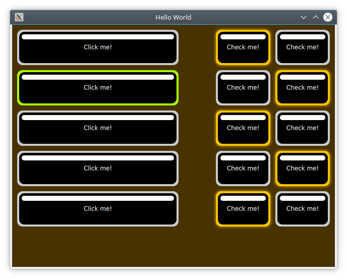
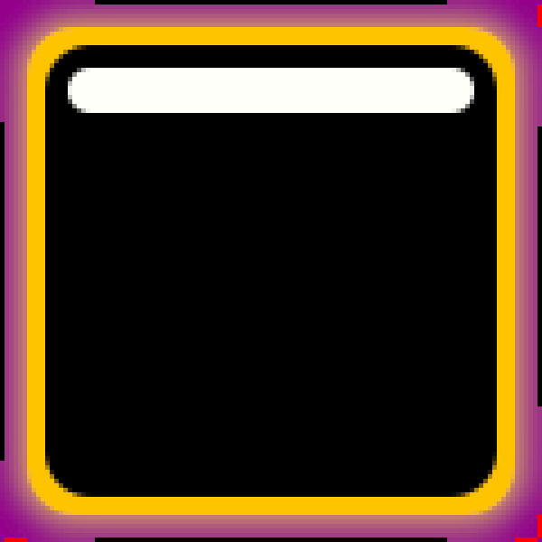

# The Imagine Style

One of the goals with Qt Quick Controls is to separate the logic of a control from its appearance. For most of the styles, the implementation of the appearance consists of a mix of QML code and graphical assets. However, using the *Imagine* style, it is possible to customize the appearance of a Qt Quick Controls based application using only graphical assets.

The imagine style is based on [9-patch images](https://developer.android.com/guide/topics/graphics/drawables#nine-patch). This allows the images to carry information on how they are stretched and what parts are to be considered as a part of the element and what is outside; e.g. a shadow. For each control, the style supports several elements, and for each element a large number of states are available. By providing assets for certain combinations of these elements and states, you can control the appearance of each control in detail.

The details of 9-patch images, and how each control can be styled is covered in great detail in the [Imagine style documentation](https://doc.qt.io/qt-6/qtquickcontrols2-imagine.html). Here, we will create a custom style for an imaginary device interface to demonstrate how the style is used.

The application's style customizes the `ApplicationWindow` and `Button` controls. For the buttons, the normal state, as well as the *pressed* and *checked* states are handled. The demonstration application is shown below.

The code for this uses a `Column` for the clickable buttons, and a `Grid` for the checkable ones. The clickable buttons also stretch with the window width.

<<< @/docs/ch06-controls/src/imagine-style/main.qml

As we are using the *Imagine* style, all controls that we want to use need to be styled using a graphical asset. The easiest is the background for the `ApplicationWindow`. This is a single pixel texture defining the background colour. By naming the file `applicationwindow-background.png` and then pointing the style to it using the `qtquickcontrols2.conf` file, the file is picked up.

In the `qtquickcontrols2.conf` file shown below, you can see how we set the `Style` to `Imagine`, and then setup a `Path` for the style where it can look for the assets. Finally we set some palette properties as well. The available palette properties can be found on the [palette QML Basic Type](https://doc.qt.io/qt-6/qml-palette.html#qtquickcontrols2-palette) page.

<<< @/docs/ch06-controls/src/imagine-style/qtquickcontrols2.conf

The assets for the `Button` control are `button-background.9.png`, `button-background-pressed.9.png` and `button-background-checked.9.png`. These follow the *control*-*element*-*state* pattern. The stateless file, `button-background.9.png` is used for all states without a specific asset. According to the [Imagine style element reference table](https://doc.qt.io/qt-6/qtquickcontrols2-imagine.html#element-reference), a button can have the following states:

* `disabled`
* `pressed`
* `checked`
* `checkable`
* `focused`
* `highlighted`
* `flat`
* `mirrored`
* `hovered`

The states that are needed depend on your user interface. For instance, the hovered style is never used for touch-based interfaces.

Looking at an enlarged version of `button-background-checked.9.png` above, you can see the 9-patch guide lines along the sides. The purple background has been added for visibility reasons. This area is actually transparent in the asset used in the example.

The pixes along the edges of the image can be either white/transparent, black, or red. These have different meanings that we will go through one by one.

* **Black** lines along the **left** and **top** sides of the asset mark the stretchable parts of the image. This means that the rounded corners and the white marker in the example are not affected when the button is stretched.

* **Black** lines along the **right** and **bottom** sides of the asset mark the area used for the control’s contents. That means the part of the button that is used for text in the example.

* **Red** lines along the **right** and **bottom** sides of the asset mark *inset* areas. These areas are a part of the image, but not considered a part of the control. For the checked image above, this is used for a soft halo extending outside the button.

A demonstration of the usage of an *inset* area is shown in `button-background.9.png` (below) and `button-background-checked.9.png` (above): the image seems to light up, but not move.

