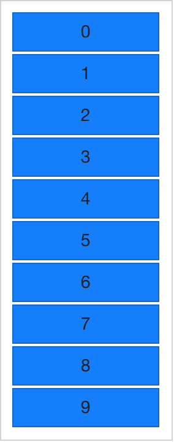
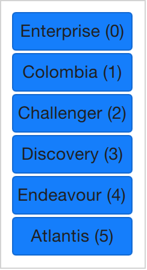
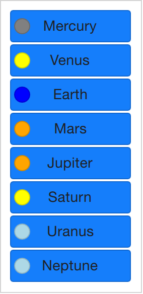

# Basic Models

The most basic way to visualize data from a model is to use the `Repeater` element. It is used to instantiate an array of items and is easy to combine with a positioner to populate a part of the user interface. A repeater uses a model, which can be anything from the number of items to instantiate, to a full-blown model gathering data from the Internet.

In its simplest form, the repeater can be used to instantiate a specified number of items. Each item will have access to an attached property, the variable `index`, that can be used to tell the items apart. In the example below, a repeater is used to create 10 instances of an item. The number of items is controlled using the `model` property. For each item, the `Rectangle` containing a `Text` element found inside the `Repeater` item, is instantiated. As you can tell, the `text` property is set to the `index` value, thus the items are numbered from zero to nine.

```qml
import QtQuick 6.2
import "../common"

Column {
    spacing: 2

    Repeater {
        model: 10
        BlueBox {
            width: 120
            height: 32
            text: index
        }
    }
}
```




As nice as lists of numbered items are, it is sometimes interesting to display a more complex data set. By replacing the integer `model` value with a JavaScript array, we can achieve that. The contents of the array can be of any type, be it strings, integers or objects. In the example below, a list of strings is used. We can still access and use the `index` variable, but we also have access to `modelData` containing the data for each element in the array.

```qml
import QtQuick 6.2
import "../common"

Column {
    spacing: 2

    Repeater {
        model: ["Enterprise", "Columbia", "Challenger", "Discovery", "Endeavour", "Atlantis"]

        BlueBox {
            width: 100
            height: 32
            radius: 3

            text: modelData + ' (' + index + ')'
        }
    }
}
```




Being able to expose the data of an array, you soon find yourself in a position where you need multiple pieces of data per item in the array. This is where models enter the picture. One of the most trivial models and one of the most commonly used is the `ListModel`. A list model is simply a collection of `ListElement` items. Inside each list element, a number of properties can be bound to values. For instance, in the example below, a name and a color are provided for each element.

The properties bound inside each element are attached to each instantiated item by the repeater. This means that the variables `name` and `surfaceColor` are available from within the scope of each `Rectangle` and `Text` item created by the repeater. This not only makes it easy to access the data, it also makes it easy to read the source code. The `surfaceColor` is the color of the circle to the left of the name, not something obscure as data from column `i` of row `j`.

```qml
import QtQuick 6.2
import "../common"

Column {
    spacing: 2

    Repeater {
        model: ListModel {
            ListElement { name: "Mercury"; surfaceColor: "gray" }
            ListElement { name: "Venus"; surfaceColor: "yellow" }
            ListElement { name: "Earth"; surfaceColor: "blue" }
            ListElement { name: "Mars"; surfaceColor: "orange" }
            ListElement { name: "Jupiter"; surfaceColor: "orange" }
            ListElement { name: "Saturn"; surfaceColor: "yellow" }
            ListElement { name: "Uranus"; surfaceColor: "lightBlue" }
            ListElement { name: "Neptune"; surfaceColor: "lightBlue" }
        }

        BlueBox {
            width: 120
            height: 32

            radius: 3
            text: name

            Box {
                anchors.left: parent.left
                anchors.verticalCenter: parent.verticalCenter
                anchors.leftMargin: 4

                width: 16
                height: 16

                radius: 8

                color: surfaceColor
            }
        }
    }
}
```




The contents of the repeater that is being instantiated for each item is actually what is bound to the default property, `delegate`. This means that the code of example Example 01 is synonymous to the code shown below. Notice that the only difference is that the `delegate` property name is spelled out explicitly in the latter.

```qml
import QtQuick 6.2
import "../common"

Column {
    spacing: 2

    Repeater {
        model: 10

        delegate: BlueBox {
            width: 100
            height: 32
            text: index
        }
    }
}
```

