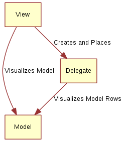

# Concept

A common pattern when developing user interfaces is to keep the representation of the data separate from the visualization. This makes it possible to show the same data in different ways depending on what task the user is performing. For instance, a phone book could be arranged as a vertical list of text entries, or as a grid of pictures of the contacts. In both cases, the data is identical: the phone book, but the visualization differs. This division is commonly referred to as the model-view pattern. In this pattern, the data is referred to as the model, while the visualization is handled by the view.

In QML, the model and view are joined by the delegate. The responsibilities are divided as follows: The model provides the data. For each data item, there might be multiple values. In the example above, each phone book entry has a name, a picture, and a number. The data is arranged in a view, in which each item is visualized using a delegate. The task of the view is to arrange the delegates, while each delegate shows the values of each model item to the user.

This means that the delegate knows about the contents of the model and how to visualize it. The view knows about the concept of delegates and how to lay them out. The model only knows about the data it is representing.

