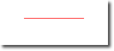

# Canvas Element

On of the strenghts of QML is its closeness to the Javascript ecosystem. This lets us reuse existing solutions from the web world and combine it with the native performance of QML visuals. However, sometimes we want to reuse graphics solutions from the web space too. That is where the `Canvas` element comes in handy. The canvas element provides an API very closely aligned to the drawing APIs for the identically named HTML element.


The fundamental idea of the canvas element is to render paths using a context 2D object. The context 2D object, contains the necessary graphics functions, whereas the canvas acts as the drawing canvas. The 2D context supports strokes, fills gradients, text and a different set of path creation commands.

Let’s see an example of a simple path drawing:

<<< @/docs/ch08-canvas/src/canvas/rectangle.qml#M1

This produces a filled rectangle with a starting point at 50,50 and a size of 100 and a stroke used as a border decoration.


The stroke width is set to 4 and uses a blue color define by `strokeStyle`. The final shape is set up to be filled through the `fillStyle` to a “steel blue” color. Only by calling `stroke` or `fill` the actual path will be drawn and they can be used independently from each other. A call to `stroke` or `fill` will draw the current path. It’s not possible to store a path for later reuse only a drawing state can be stored and restored.

In QML the `Canvas` element acts as a container for the drawing. The 2D context object provides the actual drawing operation. The actual drawing needs to be done inside the `onPaint` event handler.

```qml
Canvas {
    width: 200; height: 200
    onPaint: {
        var ctx = getContext("2d")
        // setup your path
        // fill or/and stroke
    }
}
```

The canvas itself provides a typical two-dimensional Cartesian coordinate system, where the top-left is the (0,0) point. A higher y-value goes down and a hight x-value goes to the right.

A typical order of commands for this path based API is the following:

1. Setup stroke and/or fill
2. Create path
3. Stroke and/or fill

<<< @/docs/ch08-canvas/src/canvas/line.qml#M1

This produces a horizontal stroked line from point `P1(50,50)` to point `P2(150,50)`.



::: tip
Typically you always want to set a start point when you reset your path, so the first operation after `beginPath` is often `moveTo`.
:::

