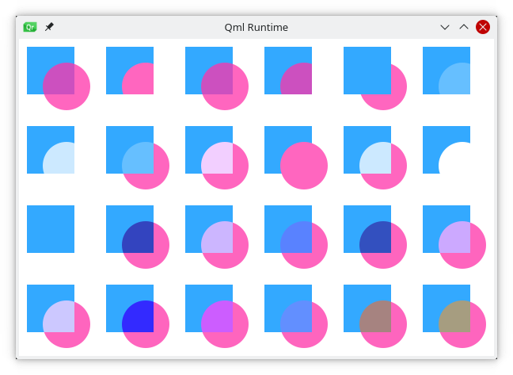

# Composition Modes

Composition allows you to draw a shape and blend it with the existing pixels. The canvas supports several composition modes using the `globalCompositeOperation(mode)` operations. For instance:

* `source-over`
* `source-in`
* `source-out`
* `source-atop`

Let's begin with a short example demonstrating the exclusive or composition:

<<< @/docs/ch08-canvas/src/canvas/composition.qml#M1

The example below will demonstrate all composition modes by iterating over them and combining a rectangle and a circle. You can find the resulting output below the source code.

<<< @/docs/ch08-canvas/src/canvas/compositeoperation.qml#M1

