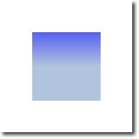

# Gradients

Canvas can fill shapes with color but also with gradients or images.

<<< @/docs/ch08-canvas/src/canvas/gradient.qml#M1

The gradient in this example is defined along the starting point (100,0) to the end point (100,200), which gives a vertical line in the middle of our canvas. The gradient-stops can be defined as a color from 0.0 (gradient start point) to 1.0 (gradient endpoint). Here we use a `blue` color at `0.0` (100,0) and a `lightsteelblue` color at the `0.5` (100,200) position. The gradient is defined as much larger than the rectangle we want to draw, so the rectangle clips gradient to it’s defined the geometry.

::: tip
The gradient is defined in canvas coordinates not in coordinates relative to the path to be painted. A canvas does not have the concept of relative coordinates, as we are used to by now from QML.
:::

