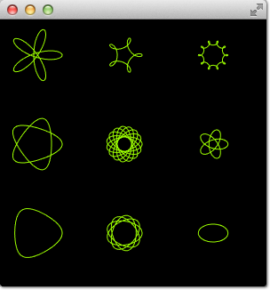
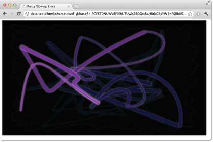
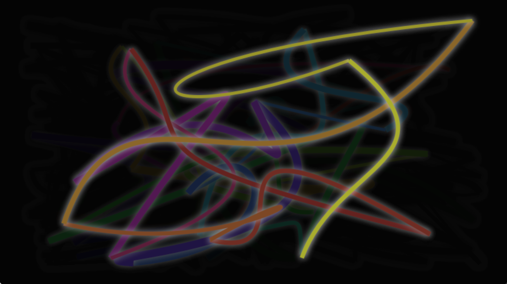

# Porting from HTML5 Canvas

Porting from an HTML5 canvas to a QML canvas is fairly easy. In this chapter we will look at the example below and do the conversion.

* [https://developer.mozilla.org/en-US/docs/Web/API/Canvas_API/Tutorial/Transformations](https://developer.mozilla.org/en-US/docs/Web/API/Canvas_API/Tutorial/Transformations)
* [http://en.wikipedia.org/wiki/Spirograph](http://en.wikipedia.org/wiki/Spirograph)

## Spirograph

We use a [spirograph](http://en.wikipedia.org/wiki/Spirograph) example from the Mozilla project as our foundation. The original HTML5 was posted as part of the [canvas tutorial](https://developer.mozilla.org/en-US/docs/Web/API/Canvas_API/Tutorial/Transformations).

There were a few lines we needed to change:


* Qt Quick requires you to declare a variable, so we needed to add some *var* declarations

    ```js
    for (var i=0;i<3;i++) {
        ...
    }
    ```


* We adapted the draw method to receive the Context2D object

    ```js
    function draw(ctx) {
        ...
    }
    ```


* We needed to adapt the translation for each spiro due to different sizes

    ```js
    ctx.translate(20+j*50,20+i*50);
    ```

Finally, we completed our `onPaint` handler. Inside we acquire a context and call our draw function.

```qml
onPaint: {
    var ctx = getContext("2d");
    draw(ctx);
}
```

The result is a ported spiro graph graphics running using the QML canvas.



As you can see, with no changes to the actual logic, and relatively few changes to the code itself, a port from HTML5 to QML is possible.

## Glowing Lines

Here is another more complicated port from the W3C organization. The original [pretty glowing lines](http://www.w3.org/TR/2dcontext/#examples) has some pretty nice aspects, which makes the porting more challenging.



```html
<!DOCTYPE HTML>
<html lang="en">
<head>
    <title>Pretty Glowing Lines</title>
</head>
<body>

<canvas width="800" height="450"></canvas>
<script>
var context = document.getElementsByTagName('canvas')[0].getContext('2d');

// initial start position
var lastX = context.canvas.width * Math.random();
var lastY = context.canvas.height * Math.random();
var hue = 0;

// closure function to draw
// a random bezier curve with random color with a glow effect
function line() {

    context.save();

    // scale with factor 0.9 around the center of canvas
    context.translate(context.canvas.width/2, context.canvas.height/2);
    context.scale(0.9, 0.9);
    context.translate(-context.canvas.width/2, -context.canvas.height/2);

    context.beginPath();
    context.lineWidth = 5 + Math.random() * 10;

    // our start position
    context.moveTo(lastX, lastY);

    // our new end position
    lastX = context.canvas.width * Math.random();
    lastY = context.canvas.height * Math.random();

    // random bezier curve, which ends on lastX, lastY
    context.bezierCurveTo(context.canvas.width * Math.random(),
    context.canvas.height * Math.random(),
    context.canvas.width * Math.random(),
    context.canvas.height * Math.random(),
    lastX, lastY);

    // glow effect
    hue = hue + 10 * Math.random();
    context.strokeStyle = 'hsl(' + hue + ', 50%, 50%)';
    context.shadowColor = 'white';
    context.shadowBlur = 10;
    // stroke the curve
    context.stroke();
    context.restore();
}

// call line function every 50msecs
setInterval(line, 50);

function blank() {
    // makes the background 10% darker on each call
    context.fillStyle = 'rgba(0,0,0,0.1)';
    context.fillRect(0, 0, context.canvas.width, context.canvas.height);
}

// call blank function every 50msecs
setInterval(blank, 40);

</script>
</body>
</html>
```

In HTML5 the Context2D object can paint at any time on the canvas. In QML it can only point inside the `onPaint` handler. The timer in usage with `setInterval` triggers in HTML5 the stroke of the line or to blank the screen. Due to the different handling in QML, it’s not possible to just call these functions, because we need to go through the `onPaint` handler. Also, the color presentations need to be adapted. Let’s go through the changes on by one.

Everything starts with the canvas element. For simplicity, we just use the `Canvas` element as the root element of our QML file.

```qml
import QtQuick

Canvas {
   id: canvas
   width: 800; height: 450

   ...
}
```

To untangle the direct call of the functions through the `setInterval`, we replace the `setInterval` calls with two timers which will request a repaint. A `Timer` is triggered after a short interval and allows us to execute some code. As we can’t tell the paint function which operation we would like to trigger we define for each operation a bool flag request an operation and trigger then a repaint request.

Here is the code for the line operation. The blank operation is similar.

```qml
...
property bool requestLine: false

Timer {
    id: lineTimer
    interval: 40
    repeat: true
    triggeredOnStart: true
    onTriggered: {
        canvas.requestLine = true
        canvas.requestPaint()
    }
}

Component.onCompleted: {
    lineTimer.start()
}
...
```

Now we have an indication which (line or blank or even both) operation we need to perform during the `onPaint` operation. As we enter the `onPaint` handler for each paint request we need to extract the initialization of the variable into the canvas element.

```qml
Canvas {
    ...
    property real hue: 0
    property real lastX: width * Math.random();
    property real lastY: height * Math.random();
    ...
}
```

Now our paint function should look like this:

```qml
onPaint: {
    var context = getContext('2d')
    if(requestLine) {
        line(context)
        requestLine = false
    }
    if(requestBlank) {
        blank(context)
        requestBlank = false
    }
}
```

The *line* function was extracted for a canvas as an argument.

```qml
function line(context) {
    context.save();
    context.translate(canvas.width/2, canvas.height/2);
    context.scale(0.9, 0.9);
    context.translate(-canvas.width/2, -canvas.height/2);
    context.beginPath();
    context.lineWidth = 5 + Math.random() * 10;
    context.moveTo(lastX, lastY);
    lastX = canvas.width * Math.random();
    lastY = canvas.height * Math.random();
    context.bezierCurveTo(canvas.width * Math.random(),
        canvas.height * Math.random(),
        canvas.width * Math.random(),
        canvas.height * Math.random(),
        lastX, lastY);

    hue += Math.random()*0.1
    if(hue > 1.0) {
        hue -= 1
    }
    context.strokeStyle = Qt.hsla(hue, 0.5, 0.5, 1.0);
    // context.shadowColor = 'white';
    // context.shadowBlur = 10;
    context.stroke();
    context.restore();
}
```

The biggest change was the use of the QML `Qt.rgba()` and `Qt.hsla()` functions, which required to adopt the values to the used 0.0 … 1.0 range in QML.

Same applies to the *blank* function.

```qml
function blank(context) {
    context.fillStyle = Qt.rgba(0,0,0,0.1)
    context.fillRect(0, 0, canvas.width, canvas.height);
}
```

The final result will look similar to this.


