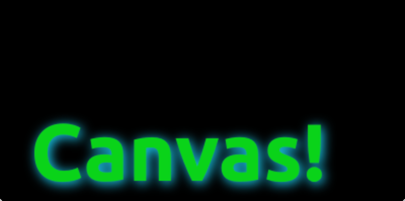

# Shadows

A path can be visually enhanced using shadows with the 2D context object. A shadow is an area around the path with an offset, color and specified blurring. For this you can specify a `shadowColor`, `shadowOffsetX`, `shadowOffsetY` and a `shadowBlur`. All of this needs to be defined using the 2D context. The 2D context is your only API to the drawing operations.

A shadow can also be used to create a glow effect around a path. In the next example, we create a text “Canvas” with a white glow around. All this on a dark background for better visibility.

First, we draw the dark background:

<<< @/docs/ch08-canvas/src/canvas/shadow.qml#M1

then we define our shadow configuration, which will be used for the next path:

<<< @/docs/ch08-canvas/src/canvas/shadow.qml#M2

Finally, we draw our “Canvas” text using a large bold 80px font from the *Ubuntu* font family.

<<< @/docs/ch08-canvas/src/canvas/shadow.qml#M3

