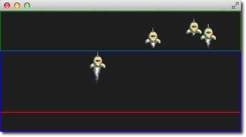
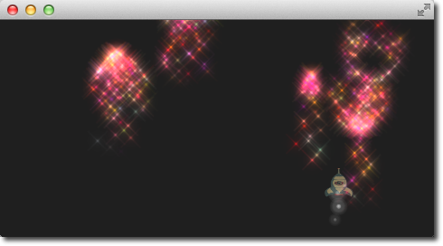

# Particle Groups

At the beginning of this chapter, we stated particles are in groups, which is by default the empty group (‘’). Using the `GroupGoal` affector is it possible to let the particle change groups. To visualize this we would like to create a small firework, where rockets start into space and explode in the air into a spectacular firework.


The example is divided into 2 parts. The 1st part called “Launch Time” is concerned to set up the scene and introduce particle groups and the 2nd part called “Let there be fireworks” focuses on the group changes.

Let’s get started!

## Launch Time

To get it going we create a typical dark scene:

```qml
import QtQuick 2.5
import QtQuick.Particles 2.0

Rectangle {
    id: root
    width: 480; height: 240
    color: "#1F1F1F"
    property bool tracer: false
}
```

The tracer property will be used to switch the tracer scene wide on and off. The next thing is to declare our particle system:

```qml
ParticleSystem {
    id: particleSystem
}
```

And our two image particles (one for the rocket and one for the exhaust smoke):

```qml
ImageParticle {
    id: smokePainter
    system: particleSystem
    groups: ['smoke']
    source: "assets/particle.png"
    alpha: 0.3
    entryEffect: ImageParticle.None
}

ImageParticle {
    id: rocketPainter
    system: particleSystem
    groups: ['rocket']
    source: "assets/rocket.png"
    entryEffect: ImageParticle.None
}
```

You can see in on the images, they use the *groups* property to declare to which group the particle belongs. It is enough to just declare a name and an implicit group will be created by Qt Quick.

Now it’s time to emit some rockets into the air. For this, we create an emitter on the bottom of our scene and set the velocity in an upward direction. To simulate some gravity we set an acceleration downwards:

```qml
Emitter {
    id: rocketEmitter
    anchors.bottom: parent.bottom
    width: parent.width; height: 40
    system: particleSystem
    group: 'rocket'
    emitRate: 2
    maximumEmitted: 4
    lifeSpan: 4800
    lifeSpanVariation: 400
    size: 32
    velocity: AngleDirection { angle: 270; magnitude: 150; magnitudeVariation: 10 }
    acceleration: AngleDirection { angle: 90; magnitude: 50 }
    Tracer { color: 'red'; visible: root.tracer }
}
```

The emitter is in the group *‘rocket’*, the same as our rocket particle painter. Through the group name, they are bound together. The emitter emits particles into the group ‘rocket’ and the rocket particle painter will pain them.

For the exhaust, we use a trail emitter, which follows our rocket. It declares an own group called ‘smoke’ and follows the particles from the ‘rocket’ group:

```qml
TrailEmitter {
    id: smokeEmitter
    system: particleSystem
    emitHeight: 1
    emitWidth: 4
    group: 'smoke'
    follow: 'rocket'
    emitRatePerParticle: 96
    velocity: AngleDirection { angle: 90; magnitude: 100; angleVariation: 5 }
    lifeSpan: 200
    size: 16
    sizeVariation: 4
    endSize: 0
}
```

The smoke is directed downwards to simulate the force the smoke comes out of the rocket. The *emitHeight* and *emitWidth* specify the are around the particle followed from where the smoke particles shall be emitted. If this is not specified then they are of the particle followed is taken but for this example, we want to increase the effect that the particles stem from a central point near the end of the rocket.

If you start the example now you will see the rockets fly up and some are even flying out of the scene. As this is not really wanted we need to slow them down before they leave the screen. A friction affector can be used here to slow the particles down to a minimum threshold:

```qml
Friction {
    groups: ['rocket']
    anchors.top: parent.top
    width: parent.width; height: 80
    system: particleSystem
    threshold: 5
    factor: 0.9
}
```

In the friction affector, you also need to declare which groups of particles it shall affect. The friction will slow all rockets, which are 80 pixels downwards from the top of the screen down by a factor of 0.9 (try 100 and you will see they almost stop immediately) until they reach a velocity of 5 pixels per second. As the particles have still an acceleration downwards applied the rockets will start sinking toward the ground after they reach the end of their life-span.

As climbing up in the air is hard work and a very unstable situation we want to simulate some turbulences while the ship is climbing:

```qml
Turbulence {
    groups: ['rocket']
    anchors.bottom: parent.bottom
    width: parent.width; height: 160
    system: particleSystem
    strength: 25
    Tracer { color: 'green'; visible: root.tracer }
}
```

Also, the turbulence needs to declare which groups it shall affect. The turbulence itself reaches from the bottom 160 pixels upwards (until it reaches the border of the friction). They also could overlap.

When you start the example now you will see the rockets are climbing up and then will be slowed down by the friction and fall back to the ground by the still applied downwards acceleration. The next thing would be to start the firework.



::: tip
The image shows the scene with the tracers enabled to show the different areas. Rocket particles are emitted in the red area and then affected by the turbulence in the blue area. Finally, they are slowed down by the friction affector in the green area and start falling again, because of the steady applied downwards acceleration.
:::

## Let there be fireworks

To be able to change the rocket into a beautiful firework we need add a `ParticleGroup` to encapsulate the changes:

```qml
ParticleGroup {
    name: 'explosion'
    system: particleSystem
}
```

We change to the particle group using a `GroupGoal` affector. The group goal affector is placed near the vertical center of the screen and it will affect the group ‘rocket’. With the *groupGoal* property we set the target group for the change to ‘explosion’, our earlier defined particle group:

```qml
GroupGoal {
    id: rocketChanger
    anchors.top: parent.top
    width: parent.width; height: 80
    system: particleSystem
    groups: ['rocket']
    goalState: 'explosion'
    jump: true
    Tracer { color: 'blue'; visible: root.tracer }
}
```

The *jump* property states the change in groups shall be immediately and not after a certain duration.

::: tip
In the Qt 5 alpha release we could the *duration* for the group change not get working. Any ideas?
:::

As the group of the rocket now changes to our ‘explosion’ particle group when the rocket particle enters the group goal area we need to add the firework inside the particle group:

```qml
// inside particle group
TrailEmitter {
    id: explosionEmitter
    anchors.fill: parent
    group: 'sparkle'
    follow: 'rocket'
    lifeSpan: 750
    emitRatePerParticle: 200
    size: 32
    velocity: AngleDirection { angle: -90; angleVariation: 180; magnitude: 50 }
}
```

The explosion emits particles into the ‘sparkle’ group. We will define soon a particle painter for this group. The trail emitter used follows the rocket particle and emits per rocket 200 particles. The particles are directed upwards and vary by 180 degrees.

As the particles are emitted into the ‘sparkle’ group, we also need to define a particle painter for the particles:

```qml
ImageParticle {
    id: sparklePainter
    system: particleSystem
    groups: ['sparkle']
    color: 'red'
    colorVariation: 0.6
    source: "assets/star.png"
    alpha: 0.3
}
```

The sparkles of our firework shall be little red stars with an almost transparent color to allow some shine effects.

To make the firework more spectacular we also add a second trail emitter to our particle group, which will emit particles in a narrow cone downwards:

```qml
// inside particle group
TrailEmitter {
    id: explosion2Emitter
    anchors.fill: parent
    group: 'sparkle'
    follow: 'rocket'
    lifeSpan: 250
    emitRatePerParticle: 100
    size: 32
    velocity: AngleDirection { angle: 90; angleVariation: 15; magnitude: 400 }
}
```

Otherwise, the setup is similar to the other explosion trail emitter. That’s it.

Here is the final result.




Here is the full source code of the rocket firework.

<<< @/docs/ch10-effects/src/particles/firework.qml#M1
