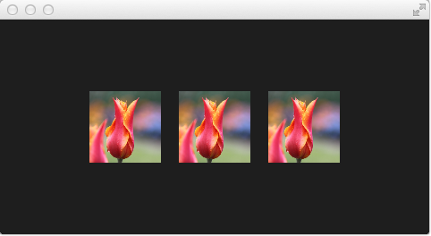

# Shader Elements

For programming shaders, Qt Quick provides two elements. The `ShaderEffectSource` and the `ShaderEffect`. The shader effect applies custom shaders and the shader effect source renders a QML item into a texture and renders it. As shader effect can apply custom shaders to its rectangular shape and can use sources for the shader operation. A source can be an image, which is used as a texture or a shader effect source.

The default shader uses the source and renders it unmodified. Below, we first see the QML file with two `ShaderEffect` elements. One without any shaders specified, and one explicitly specifying default vertex and fragment shaders. We will look at the shaders shortly.

<<< @/docs/ch10-effects/src/effects/default/defaultshader.qml#M1



In the above example, we have a row of 3 images. The first is the real image. The second is rendered using the default shader and the third is rendered using the shader code for the fragment and vertex as shown below. Let's have a look at the shaders.

The vertex shader takes the texture coordinate, `qt_MultiTexCoord0`, and propagates it to the `qt_TexCoord0` variable. It also takes the `qt_Vertex` position and multiplies it with Qt's transformation matrix, `ubuf.qt_Matrix`, and returns it through the `gl_Position` variable. This leaves the texture and vertex position on the screen unmodified.

<<< @/docs/ch10-effects/src/effects/default/default.vert#M1

The fragment shader takes the texture from the `source` 2D sampler, i.e. the texture, at the coordinate `qt_TexCoord0` and multiplies it with the Qt opacity, `ubuf.qt_Opacity` to calculate the `fragColor` which is the color to be used for the pixel.

<<< @/docs/ch10-effects/src/effects/default/default.frag#M1

Notice that these two shaders can serve as the boilerplate code for your own shaders. The variables, locations and bindings, are what Qt expects. You can read more about the exact details of this on the [Shader Effect Documentation](https://doc-snapshots.qt.io/qt6-6.2/qml-qtquick-shadereffect.html#details).

Before we can use the shaders, they need to be baked. If the shaders are a part of a larger Qt project and included as resources, this can be automated. However, when working with the shaders and a `qml`-file, we need to explicitly bake them by hand. This is done using the following two commands:

```
qsb --glsl 100es,120,150 --hlsl 50 --msl 12    -o default.frag.qsb default.frag 
qsb --glsl 100es,120,150 --hlsl 50 --msl 12 -b -o default.vert.qsb default.vert
```

The `qsb` tool is located in the `bin` directory of your Qt 6 installation.

::: tip
If you don’t want to see the source image and only the effected image you can set the *Image* to invisible (\`\` visible: false\`\`). The shader effects will still use the image data just the *Image* element will not be rendered.
:::

In the next examples, we will be playing around with some simple shader mechanics. First, we concentrate on the fragment shader and then we will come back to the vertex shader.
