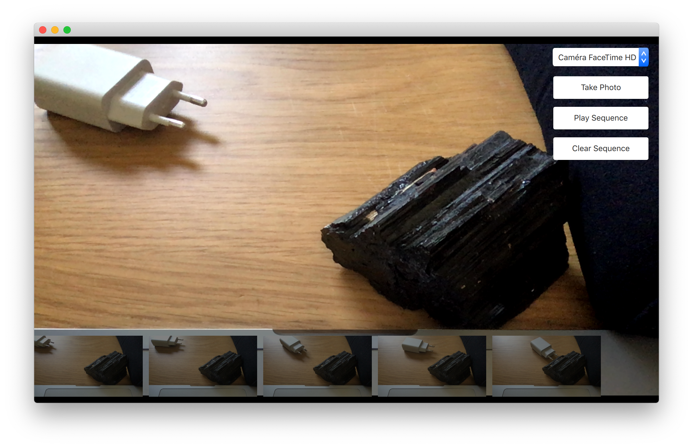

# Capturing Images

One of the key features of the `Camera` element is that is can be used to take pictures. We will use this in a simple stop-motion application. By building the application, you will learn how to show a viewfinder, switch between cameras, snap photos and keep track of the pictures taken.

The user interface is shown below. It consists of three major parts. In the background, you will find the viewfinder, to the right, a column of buttons and at the bottom, a list of images taken. The idea is to take a series of photos, then click the `Play Sequence` button. This will play the images back, creating a simple stop-motion film.



## The viewfinder

The viewfinder part of the camera is made using a `VideoOutput` element as video output channel of a `CaptureSession`. The `CaptureSession` in turns uses a `Camera` component to configure the device. This will display a live video stream from the camera.

```qml
CaptureSession {
    id: captureSession
    videoOutput: output
    camera: Camera {} 
    imageCapture: ImageCapture {
        /* ... */
    }
}

VideoOutput {
    id: output
    anchors.fill: parent
}
```

::: tip
You can have more control on the camera behaviour by using dedicated `Camera` properties such as `exposureMode`, `whiteBalanceMode` or `zoomFactor`.
:::

## The captured images list

The list of photos is a `ListView` oriented horizontally that shows images from a `ListModel` called `imagePaths`. In the background, a semi-transparent black `Rectangle` is used.

```qml
ListModel {
    id: imagePaths
}

ListView {
    id: listView

    anchors.left: parent.left
    anchors.right: parent.right
    anchors.bottom: parent.bottom
    anchors.bottomMargin: 10

    height: 100

    orientation: ListView.Horizontal
    spacing: 10

    model: imagePaths

    delegate: Image {
        height: 100
        source: path
        fillMode: Image.PreserveAspectFit
    }

    Rectangle {
        anchors.fill: parent
        anchors.topMargin: -10

        color: "black"
        opacity: 0.5
    }
}
```

For the shooting of images, the `CaptureSession` element contains a set of sub-elements for various tasks. To capture still pictures, the `CaptureSession.imageCapture` element is used. When you call the `captureToFile` method, a picture is taken and saved in the user's local pictures directory. This results in the `CaptureSession.imageCapture` emitting the `imageSaved` signal.

```qml
Button {
    id: shotButton
    
    width: parent.buttonWidth
    height: parent.buttonHeight

    text: qsTr("Take Photo")
    onClicked: {
        captureSession.imageCapture.captureToFile()
    }
}
```

In this case, we don’t need to show a preview image, but simply add the resulting image to the `ListView` at the bottom of the screen. Shown in the example below, the path to the saved image is provided as the `path` argument with the signal.

```qml
CaptureSession {
    /* ... */
    imageCapture: ImageCapture {
        onImageSaved: function (id, path) {
            imagePaths.append({"path": path})
            listView.positionViewAtEnd()
        }
    }
}
```

:::tip
For showing a preview, connect to the `imageCaptured` signal and use the `preview` signal argument as `source` of an `Image` element. An `id` signal argument is sent along both the `imageCaptured` and `imageSaved`. This value is returned from the `capture` method. Using this, the capture of an image can be traced through the complete cycle. This way, the preview can be used first and then be replaced by the properly saved image. This, however, is nothing that we do in the example.
:::

## Switching between cameras

If the user has multiple cameras, it can be handy to provide a way of switching between those. It's possible to achieve this by using the `MediaDevices` element in conjunction with a `ListView`. In our case, we'll use a `ComboBox` component:

```qml
MediaDevices {
    id: mediaDevices
}

ComboBox {
    id: cameraComboBox

    width: parent.buttonWidth
    height: parent.buttonHeight

    model: mediaDevices.videoInputs
    textRole: "description"

    displayText: captureSession.camera.cameraDevice.description

    onActivated: function (index) {
        captureSession.camera.cameraDevice = cameraComboBox.currentValue
    }
}
```

The `model` property of the `ComboBox` is set to the `videoInputs` property of our `MediaDevices`. This last property contains the list of usable video inputs. We then set the `displayText` of the control to the description of the camera device (`captureSession.camera.cameraDevice.description`).

Finally, when the user switches the video input, the cameraDevice is updated to reflect that change: `captureSession.camera.cameraDevice = cameraComboBox.currentValue`.

## The playback

The last part of the application is the actual playback. This is driven using a `Timer` element and some JavaScript. The `_imageIndex` variable is used to keep track of the currently shown image. When the last image has been shown, the playback is stopped. In the example, the `root.state` is used to hide parts of the user interface when playing the sequence.

```qml
property int _imageIndex: -1

function startPlayback() {
    root.state = "playing"
    setImageIndex(0)
    playTimer.start()
}

function setImageIndex(i) {
    _imageIndex = i

    if (_imageIndex >= 0 && _imageIndex < imagePaths.count) {
        image.source = imagePaths.get(_imageIndex).path
    } else {
        image.source = ""
    }
}

Timer {
    id: playTimer

    interval: 200
    repeat: false

    onTriggered: {
        if (_imageIndex + 1 < imagePaths.count) {
            setImageIndex(_imageIndex + 1)
            playTimer.start()
        } else {
            setImageIndex(-1)
            root.state = ""
        }
    }
}
```

