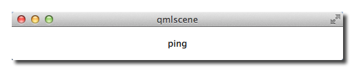

# Web Sockets

The WebSockets module provides an implementation of the WebSockets protocol for WebSockets clients and servers. It mirrors the Qt CPP module. It allows sending a string and binary messages using a full duplex communication channel. A WebSocket is normally established by making an HTTP connection to the server and the server then “upgrades” the connection to a WebSocket connection.

In Qt/QML you can also simply use the WebSocket and WebSocketServer objects to creates direct WebSocket connection. The WebSocket protocol uses the “ws” URL schema or “wss” for a secure connection.

You can use the web socket qml module by importing it first.

```qml
import QtWebSockets

WebSocket {
    id: socket
}
```

To test your web socket we will use the echo server from [http://websocket.org](http://websocket.org).

```qml
import QtQuick
import QtWebSockets

Text {
    width: 480
    height: 48

    horizontalAlignment: Text.AlignHCenter
    verticalAlignment: Text.AlignVCenter

    WebSocket {
        id: socket
        url: "ws://echo.websocket.org"
        active: true
        onTextMessageReceived: function (message) {
            text = message
        }
        onStatusChanged: {
            if (socket.status == WebSocket.Error) {
                console.log("Error: " + socket.errorString)
            } else if (socket.status == WebSocket.Open) {
                socket.sendTextMessage("ping")
            } else if (socket.status == WebSocket.Closed) {
                text += "\nSocket closed"
            }
        }
    }
}
```

You should see the ping message we send `socket.sendTextMessage("ping")` as response in the text field.




## WS Server

You can easily create your own WS server using the C++ part of the Qt WebSocket or use a different WS implementation, which I find very interesting. It is interesting because it allows connecting the amazing rendering quality of QML with the great expanding web application servers. In this example, we will use a Node JS based web socket server using the [ws](https://npmjs.org/package/ws) module. For this, you first need to install [node js](http://nodejs.org/). Then, create a `ws_server` folder and install the ws package using the node package manager (npm).

The code shall create a simple echo server in NodeJS to echo our messages back to our QML client.


```sh
cd ws_server
npm install ws
```

The npm tool downloads and installs the ws package and dependencies into your local folder.

A `server.js` file will be our server implementation. The server code will create a web socket server on port 3000 and listens to an incoming connection. On an incoming connection, it will send out a greeting and waits for client messages. Each message a client sends on a socket will be sent back to the client.

```js
var WebSocketServer = require('ws').Server;

var server = new WebSocketServer({ port : 3000 });

server.on('connection', function(socket) {
	console.log('client connected');
	socket.on('message', function(msg) {
		console.log('Message: %s', msg);
		socket.send(msg);
	});
	socket.send('Welcome to Awesome Chat');
});

console.log('listening on port ' + server.options.port);

```

You need to get used to the notation of JavaScript and the function callbacks.

## WS Client

On the client side, we need a list view to display the messages and a TextInput for the user to enter a new chat message.

We will use a label with white color in the example.

```qml
// Label.qml
import QtQuick

Text {
    color: '#fff'
    horizontalAlignment: Text.AlignLeft
    verticalAlignment: Text.AlignVCenter
}
```

Our chat view is a list view, where the text is appended to a list model. Each entry is displayed using a row of prefix and message label. We use a cell width `cw` factor to split the with into 24 columns.

```qml
// ChatView.qml
import QtQuick

ListView {
    id: root
    width: 100
    height: 62

    model: ListModel {}

    function append(prefix, message) {
        model.append({prefix: prefix, message: message})
    }

    delegate: Row {
        width: root.width
        height: 18
        property real cw: width/24
        Label {
            width: cw*1
            height: parent.height
            text: model.prefix
        }
        Label {
            width: cw*23
            height: parent.height
            text: model.message
        }
    }
}
```

The chat input is just a simple text input wrapped with a colored border.

```qml
// ChatInput.qml
import QtQuick

FocusScope {
    id: root
    width: 240
    height: 32
    Rectangle {
        anchors.fill: parent
        color: '#000'
        border.color: '#fff'
        border.width: 2
    }

    property alias text: input.text

    signal accepted(string text)

    TextInput {
        id: input
        anchors.left: parent.left
        anchors.right: parent.right
        anchors.verticalCenter: parent.verticalCenter
        anchors.leftMargin: 4
        anchors.rightMargin: 4
        onAccepted: root.accepted(text)
        color: '#fff'
        focus: true
    }
}
```

When the web socket receives a message it appends the message to the chat view. Same applies for a status change. Also when the user enters a chat message a copy is appended to the chat view on the client side and the message is sent to the server.

```qml
// ws_client.qml
import QtQuick
import QtWebSockets

Rectangle {
    width: 360
    height: 360
    color: '#000'

    ChatView {
        id: box
        anchors.left: parent.left
        anchors.right: parent.right
        anchors.top: parent.top
        anchors.bottom: input.top
    }
    ChatInput {
        id: input
        anchors.left: parent.left
        anchors.right: parent.right
        anchors.bottom: parent.bottom
        focus: true
        onAccepted: function (text) {
            print('send message: ' + text)
            socket.sendTextMessage(text)
            box.append('>', text)
            text = ''
        }
    }
    WebSocket {
        id: socket

        url: "ws://localhost:3000"
        active: true
        onTextMessageReceived: function (message) {
            box.append('<', message)
        }
        onStatusChanged: {
            if (socket.status == WebSocket.Error) {
                box.append('#', 'socket error ' + socket.errorString)
            } else if (socket.status == WebSocket.Open) {
                box.append('#', 'socket open')
            } else if (socket.status == WebSocket.Closed) {
                box.append('#', 'socket closed')
            }
        }
    }
}
```

You need first run the server and then the client. There is no retry connection mechanism in our simple client.

Running the server

```sh
cd ws_server
node server.js
```

Running the client

```sh
cd ws_client
qml ws_client.qml
```

When entering text and pressing enter you should see something like this.


