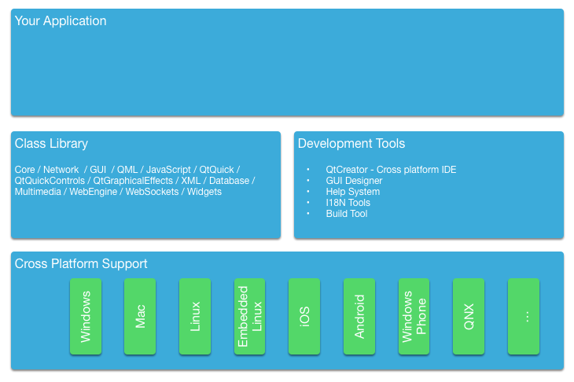

# Qt and C++

Qt is a C++ toolkit with an extension for QML and Javascript. There exist many language bindings for Qt, but as Qt itself is developed in C++. The spirit of C++ can be found throughout the classes. In this section, we will look at Qt from a C++ perspective to build a better understanding of how to extend QML with native plugins developed using C++. Through C++, it is possible to extend and control the execution environment provided to QML.

This chapter will, just as Qt, require the reader to have some basic knowledge of C++. Qt does not rely on advanced C++ features and I generally consider the Qt style of C++ to be very readable, so do not worry if you feel that your C++ knowledge is shaky.

## Qt C++

Approaching Qt from a C++ direction, you will find that Qt enriches C++ with a number of modern language features enabled through making introspection data available. This is made possible through the use of the `QObject` base class. Introspection data, or metadata, maintains information of the classes at run-time, something that ordinary C++ does not do. This makes it possible to dynamically probe objects for information about such details as their properties and available methods.

Qt uses this meta information to enable a very loosely bound callback concept using signals and slots. Each signal can be connected to any number of slots or even other signals. When a signal is emitted from an object instance, the connected slots are invoked. As the signal emitting object does not need to know anything about the object owning the slot and vice versa, this mechanism is used to create very reusable components with very few inter-component dependencies.

## Qt for Python

The introspection features are also used to create dynamic language bindings, making it possible to expose a C++ object instance to QML and making C++ functions callable from Javascript. Other bindings for Qt C++ exist and besides the standard Javascript binding, the official one is the Python binding called [PySide6](https://www.qt.io/qt-for-python).

## Cross Platform

In addition to this central concept, Qt makes it possible to develop cross-platform applications using C++. Qt C++ provides a platform abstraction on the different operating systems, which allows the developer to concentrate on the task at hand and not the details of how you open a file on different operating systems. This means you can re-compile the same source code for Windows, OS X, and Linux and Qt takes care of the different OS ways of handling certain things. The end result is natively built applications with the look and feel of the target platform. As the mobile is the new desktop, newer Qt versions can also target a number of mobile platforms using the same source code, e.g. iOS, Android, Jolla, BlackBerry, Ubuntu Phone, Tizen.

When it comes to re-using, not only can source code be re-used but developer skills are also reusable. A team knowing Qt can reach out to far more platforms then a team just focusing on a single platform specific technology and as Qt is so flexible the team can create different system components using the same technology.

For all platform, Qt offers a set of basic types, e.g. strings with full Unicode support, lists, vectors, buffers. It also provides a common abstraction to the target platform’s main loop, and cross-platform threading and networking support. The general philosophy is that for an application developer Qt comes with all required functionality included. For domain-specific tasks such as to interface to your native libraries, Qt comes with several helper classes to make this easier.

