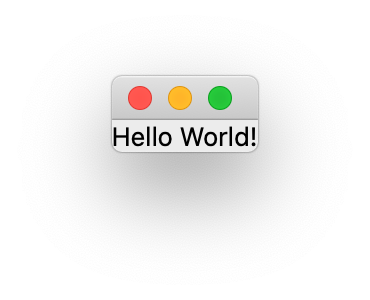

# Installing

Qt for Python is available through PyPA using `pip` under the name `pyside6`. In the example below we setup a `venv` environment in which we will install the latest version of Qt for Python:

```sh
mkdir qt-for-python
cd qt-for-python
python3 -m venv .
source bin/activate
(qt-for-python) $ python --version
Python 3.9.6
```

When the environment is setup, we continue to install `pyside6` using `pip`:

```sh
(qt-for-python) $ pip install pyside6
Collecting pyside6
Downloading [ ... ] (60.7 MB)
Collecting shiboken6==6.1.2
Downloading [ ... ] (1.0 MB)
Installing collected packages: shiboken6, pyside6
Successfully installed pyside6-6.1.2 shiboken6-6.1.2
```

After the installation, we can test it by running a *Hello World* example from the interactive Python prompt:

```sh
(qt-for-python) $ python
Python 3.9.6 (default, Jun 28 2021, 06:20:32) 
[Clang 12.0.0 (clang-1200.0.32.29)] on darwin
Type "help", "copyright", "credits" or "license" for more information.
>>> from PySide6 import QtWidgets
>>> import sys
>>> app = QtWidgets.QApplication(sys.argv)
>>> widget = QtWidgets.QLabel("Hello World!")
>>> widget.show()
>>> app.exec()
0
>>>
```

The example results in a window such as the one shown below. To end the program, close the window.



